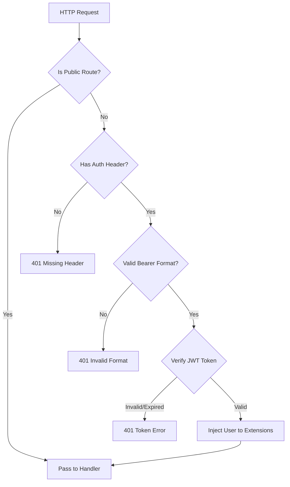
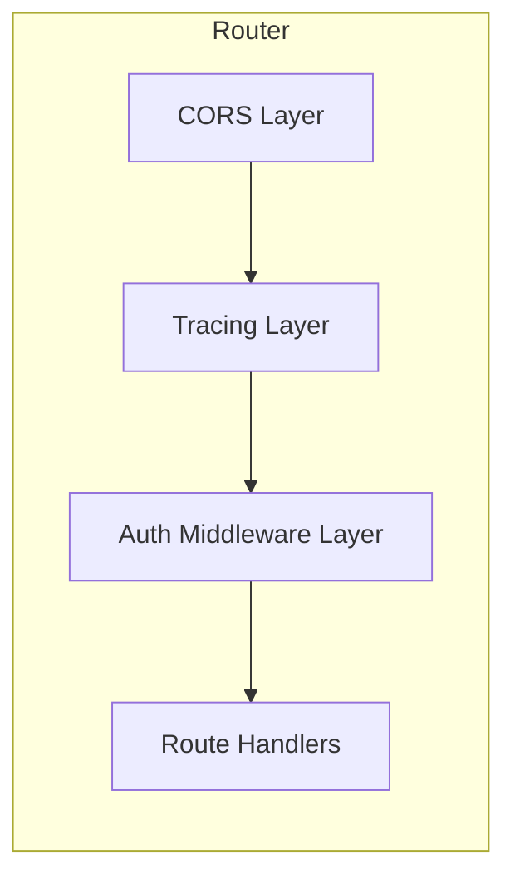

# Design Document: Auth Middleware

## Overview

本设计实现一个 Axum 中间件层，用于在请求到达 handler 之前自动验证 JWT token。中间件将：
1. 检查请求路径是否为公开路由
2. 对非公开路由验证 Authorization header 中的 JWT token
3. 将验证后的用户信息注入请求 extensions
4. 返回统一格式的认证错误响应

## Architecture



### Layer Structure



## Components and Interfaces

### 1. AuthMiddleware

核心中间件结构，实现 `tower::Layer` trait。位于 `backend/src/middlewares/auth.rs`。

```rust
pub struct AuthMiddlewareLayer {
    auth_service: Arc<AuthService>,
    public_routes: Vec<String>,
}

impl AuthMiddlewareLayer {
    pub fn new(auth_service: Arc<AuthService>) -> Self;
    pub fn with_public_routes(self, routes: Vec<String>) -> Self;
}
```

### 2. AuthMiddlewareService

实现 `tower::Service` trait 的中间件服务。

```rust
pub struct AuthMiddlewareService<S> {
    inner: S,
    auth_service: Arc<AuthService>,
    public_routes: Vec<String>,
}
```

### 3. Public Route Matching

公开路由匹配逻辑，支持精确匹配。

```rust
fn is_public_route(path: &str, public_routes: &[String]) -> bool;
```

### 4. Request Extensions

用户信息通过 request extensions 传递给 handler。

```rust
// 复用现有的 AuthUser 结构
pub struct AuthUser {
    pub user_id: i64,
    pub username: String,
}
```

## Data Models

### AuthUser (已存在)

```rust
#[derive(Debug, Clone)]
pub struct AuthUser {
    pub user_id: i64,
    pub username: String,
}
```

### Error Response

```rust
#[derive(Serialize)]
pub struct AuthErrorResponse {
    pub error: String,
    pub code: String,
    pub message: String,
}
```

## Correctness Properties

*A property is a characteristic or behavior that should hold true across all valid executions of a system-essentially, a formal statement about what the system should do. Properties serve as the bridge between human-readable specifications and machine-verifiable correctness guarantees.*

### Property 1: Protected routes reject unauthenticated requests

*For any* protected route path and *for any* request without a valid JWT token (missing, malformed, invalid signature, or expired), the middleware SHALL return a 401 Unauthorized response.

**Validates: Requirements 1.1, 1.2, 1.3**

### Property 2: Valid tokens allow access to protected routes

*For any* protected route path and *for any* request with a valid, non-expired JWT token, the middleware SHALL allow the request to proceed to the handler (not return 401).

**Validates: Requirements 1.4**

### Property 3: Public routes bypass authentication

*For any* route path that matches a configured public route pattern, the middleware SHALL allow the request to proceed regardless of authentication status.

**Validates: Requirements 2.2, 2.3**

### Property 4: User info is available after successful auth

*For any* request with a valid JWT token that passes through the middleware, the user_id and username from the token claims SHALL be available in request extensions.

**Validates: Requirements 3.1, 3.2**

### Property 5: Error responses have correct format

*For any* authentication failure, the middleware SHALL return a JSON response containing "error", "code", and "message" fields with appropriate values.

**Validates: Requirements 4.1, 4.2, 4.3**

## Error Handling

| Scenario | HTTP Status | Error Code | Message |
|----------|-------------|------------|---------|
| Missing Authorization header | 401 | UNAUTHORIZED | Missing authorization header |
| Invalid header format (not Bearer) | 401 | UNAUTHORIZED | Invalid authorization header format |
| Token verification failed | 401 | UNAUTHORIZED | {verification error message} |
| Token expired | 401 | UNAUTHORIZED | Token has expired |

所有错误响应格式：
```json
{
  "error": "Unauthorized",
  "code": "UNAUTHORIZED", 
  "message": "具体错误信息"
}
```

## Testing Strategy

### Property-Based Testing

使用 `proptest` 库进行属性测试：

1. **Token Generation Strategy**: 生成各种有效和无效的 JWT token
   - 有效 token：正确签名、未过期
   - 无效 token：错误签名、过期、格式错误

2. **Route Path Strategy**: 生成各种路由路径
   - 公开路由路径
   - 受保护路由路径

3. **Test Properties**:
   - Property 1: 对任意受保护路由，无效认证返回 401
   - Property 2: 对任意受保护路由，有效认证允许通过
   - Property 3: 对任意公开路由，无论认证状态都允许通过
   - Property 4: 有效认证后，用户信息可从 extensions 获取
   - Property 5: 认证失败返回正确的 JSON 格式

### Unit Tests

1. 测试 `is_public_route` 函数的路径匹配逻辑
2. 测试中间件与现有 `AuthUser` extractor 的兼容性
3. 测试特定错误场景的响应内容

### Integration Tests

1. 测试完整请求流程：登录 -> 获取 token -> 访问受保护路由
2. 测试中间件在 router 中的正确集成
