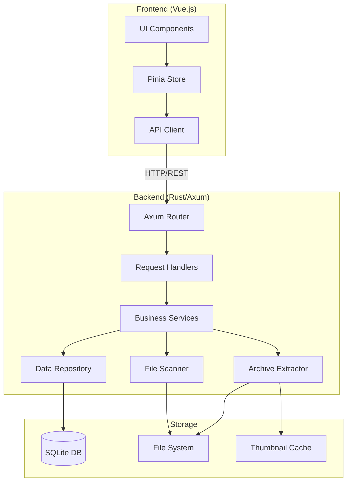
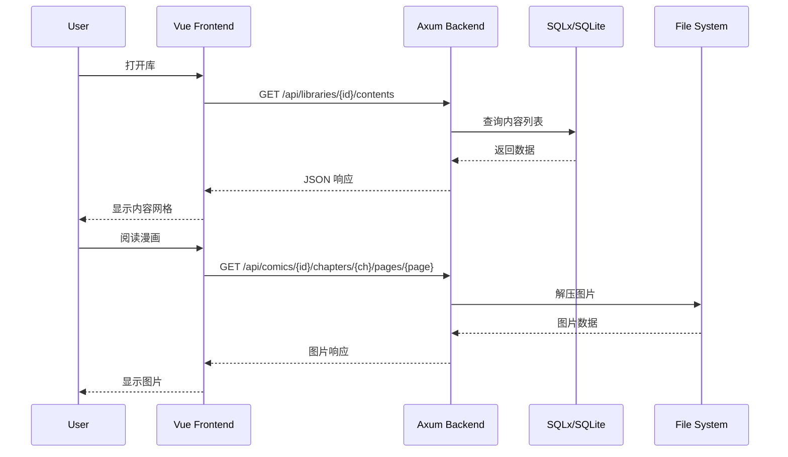

# Design Document

## Overview

本设计文档描述了一个 Web 端漫画/小说阅读软件的技术架构和实现方案。系统采用前后端分离架构：

- **前端**: Vue.js 3 + TypeScript + Vite
- **后端**: Rust + Axum + SQLx
- **数据库**: SQLite

系统支持多库管理，每个库可关联多个扫描路径，支持漫画（图片）和小说（文本）两种内容类型的导入、管理和阅读。

## Architecture



### 请求流程



## Components and Interfaces

### Backend Components

#### 1. API Router (Axum)

```rust
// 路由定义
pub fn create_router(state: AppState) -> Router {
    Router::new()
        // Library routes
        .route("/api/libraries", get(list_libraries).post(create_library))
        .route("/api/libraries/:id", get(get_library).put(update_library).delete(delete_library))
        .route("/api/libraries/:id/scan", post(scan_library))
        .route("/api/libraries/:id/paths", post(add_scan_path))
        .route("/api/libraries/:id/paths/:path_id", delete(remove_scan_path))
        .route("/api/libraries/:id/watch", post(start_watch).delete(stop_watch))
        
        // Comic routes (漫画库内容管理和阅读)
        .route("/api/libraries/:id/comics", get(list_comics))
        .route("/api/libraries/:id/comics/search", get(search_comics))
        .route("/api/comics/:id", get(get_comic).delete(delete_comic))
        .route("/api/comics/:id/chapters", get(list_comic_chapters))
        .route("/api/comics/:id/chapters/:chapter/pages/:page", get(get_comic_page))
        .route("/api/comics/:id/progress", get(get_comic_progress).put(update_comic_progress))
        
        // Novel routes (小说库内容管理和阅读)
        .route("/api/libraries/:id/novels", get(list_novels))
        .route("/api/libraries/:id/novels/search", get(search_novels))
        .route("/api/novels/:id", get(get_novel).delete(delete_novel))
        .route("/api/novels/:id/chapters", get(list_novel_chapters))
        .route("/api/novels/:id/chapters/:chapter", get(get_novel_chapter))
        .route("/api/novels/:id/progress", get(get_novel_progress).put(update_novel_progress))
        
        // Auth routes
        .route("/api/auth/register", post(register))
        .route("/api/auth/login", post(login))

        .route("/api/auth/me", get(get_current_user))
        .route("/api/auth/password", put(update_password))
        
        // Bangumi metadata routes
        .route("/api/bangumi/search", get(search_bangumi))
        .route("/api/comics/:id/metadata", get(get_comic_metadata).post(scrape_comic_metadata).put(update_comic_metadata))
        
        // Thumbnail routes (从数据库读取 BLOB)
        .route("/api/comics/:id/thumbnail", get(get_comic_thumbnail))
        .route("/api/novels/:id/thumbnail", get(get_novel_thumbnail))
        
        .with_state(state)
}
```

#### 2. Data Models

```rust
// User 模型
#[derive(Debug, Clone, Serialize, Deserialize, sqlx::FromRow)]
pub struct User {
    pub id: i64,
    pub username: String,
    pub password_hash: String,
    pub created_at: DateTime<Utc>,
    pub updated_at: DateTime<Utc>,
}

// JWT Claims
#[derive(Debug, Clone, Serialize, Deserialize)]
pub struct JwtClaims {
    pub sub: i64,        // user_id
    pub username: String,
    pub exp: i64,        // 过期时间戳
    pub iat: i64,        // 签发时间戳
}

// Library 模型
#[derive(Debug, Clone, Serialize, Deserialize, sqlx::FromRow)]
pub struct Library {
    pub id: i64,
    pub name: String,
    pub content_type: ContentType,  // "comic" | "novel"
    pub scan_interval: i32,         // 扫描间隔（分钟），0 表示禁用
    pub watch_mode: bool,           // 是否启用文件监听
    pub created_at: DateTime<Utc>,
    pub updated_at: DateTime<Utc>,
}

// ScanPath 模型
#[derive(Debug, Clone, Serialize, Deserialize, sqlx::FromRow)]
pub struct ScanPath {
    pub id: i64,
    pub library_id: i64,
    pub path: String,
    pub created_at: DateTime<Utc>,
}

// Comic 模型
#[derive(Debug, Clone, Serialize, Deserialize, sqlx::FromRow)]
pub struct Comic {
    pub id: i64,
    pub library_id: i64,
    pub scan_path_id: i64,
    pub title: String,
    pub folder_path: String,
    pub chapter_count: i32,
    pub thumbnail: Option<Vec<u8>>,  // 压缩后的缩略图二进制数据
    pub metadata: Option<String>,     // JSON 格式的元数据
    pub created_at: DateTime<Utc>,
    pub updated_at: DateTime<Utc>,
}

// ComicMetadata 结构 (存储为 JSON，字段可选)
// 由于 Bangumi API 返回的数据不一定完整，所有字段都是可选的
#[derive(Debug, Clone, Serialize, Deserialize, Default)]
pub struct ComicMetadata {
    #[serde(skip_serializing_if = "Option::is_none")]
    pub bangumi_id: Option<i64>,
    #[serde(skip_serializing_if = "Option::is_none")]
    pub title_cn: Option<String>,
    #[serde(skip_serializing_if = "Option::is_none")]
    pub title_original: Option<String>,
    #[serde(skip_serializing_if = "Option::is_none")]
    pub author: Option<String>,
    #[serde(skip_serializing_if = "Option::is_none")]
    pub description: Option<String>,
    #[serde(skip_serializing_if = "Option::is_none")]
    pub rating: Option<f32>,
    #[serde(skip_serializing_if = "Option::is_none")]
    pub rating_count: Option<i32>,
    #[serde(skip_serializing_if = "Option::is_none")]
    pub tags: Option<Vec<String>>,
    #[serde(skip_serializing_if = "Option::is_none")]
    pub cover_url: Option<String>,
    #[serde(skip_serializing_if = "Option::is_none")]
    pub bangumi_url: Option<String>,
    // 允许存储额外的自定义字段
    #[serde(flatten)]
    pub extra: Option<serde_json::Value>,
}

// Novel 模型
#[derive(Debug, Clone, Serialize, Deserialize, sqlx::FromRow)]
pub struct Novel {
    pub id: i64,
    pub library_id: i64,
    pub scan_path_id: i64,
    pub title: String,
    pub folder_path: String,
    pub chapter_count: i32,
    pub thumbnail: Option<Vec<u8>>,  // 压缩后的缩略图二进制数据
    pub created_at: DateTime<Utc>,
    pub updated_at: DateTime<Utc>,
}

// Chapter 模型
#[derive(Debug, Clone, Serialize, Deserialize, sqlx::FromRow)]
pub struct Chapter {
    pub id: i64,
    pub content_id: i64,
    pub title: String,
    pub file_path: String,
    pub sort_order: i32,
}

// ReadingProgress 模型
#[derive(Debug, Clone, Serialize, Deserialize, sqlx::FromRow)]
pub struct ReadingProgress {
    pub id: i64,
    pub user_id: i64,
    pub content_id: i64,
    pub chapter_id: i64,
    pub position: i32,  // 页码(漫画) 或 字符位置(小说)
    pub percentage: f32,
    pub updated_at: DateTime<Utc>,
}

#[derive(Debug, Clone, Serialize, Deserialize, sqlx::Type)]
#[sqlx(type_name = "TEXT")]
pub enum ContentType {
    Comic,
    Novel,
}
```

#### 3. Service Layer

```rust
// LibraryService - 库管理服务
pub trait LibraryService {
    async fn create_library(&self, req: CreateLibraryRequest) -> Result<Library>;
    async fn get_library(&self, id: i64) -> Result<Option<Library>>;
    async fn list_libraries(&self) -> Result<Vec<LibraryWithStats>>;
    async fn update_library(&self, id: i64, req: UpdateLibraryRequest) -> Result<Library>;
    async fn delete_library(&self, id: i64) -> Result<()>;
    async fn add_scan_path(&self, library_id: i64, path: String) -> Result<ScanPath>;
    async fn remove_scan_path(&self, library_id: i64, path_id: i64) -> Result<()>;
}

// WatchService - 文件监听服务
pub trait WatchService {
    async fn start_watching(&self, library_id: i64) -> Result<()>;
    async fn stop_watching(&self, library_id: i64) -> Result<()>;
    async fn is_watching(&self, library_id: i64) -> bool;
}

// SchedulerService - 定时扫描服务
pub trait SchedulerService {
    async fn schedule_scan(&self, library_id: i64, interval_minutes: i32) -> Result<()>;
    async fn cancel_scan(&self, library_id: i64) -> Result<()>;
    async fn get_next_scan_time(&self, library_id: i64) -> Option<DateTime<Utc>>;
}

// ScanService - 扫描服务
pub trait ScanService {
    async fn scan_library(&self, library_id: i64) -> Result<ScanResult>;
    async fn scan_path(&self, scan_path: &ScanPath, content_type: ContentType) -> Result<Vec<Content>>;
}

// ComicService - 漫画服务
pub trait ComicService {
    async fn get_comic(&self, id: i64) -> Result<Option<Comic>>;
    async fn list_comics(&self, library_id: i64) -> Result<Vec<Comic>>;
    async fn search_comics(&self, library_id: i64, query: &str) -> Result<Vec<Comic>>;
    async fn delete_comic(&self, id: i64) -> Result<()>;
    async fn get_page(&self, comic_id: i64, chapter: i32, page: i32) -> Result<Vec<u8>>;
    async fn list_chapters(&self, comic_id: i64) -> Result<Vec<Chapter>>;
}

// NovelService - 小说服务
pub trait NovelService {
    async fn get_novel(&self, id: i64) -> Result<Option<Novel>>;
    async fn list_novels(&self, library_id: i64) -> Result<Vec<Novel>>;
    async fn search_novels(&self, library_id: i64, query: &str) -> Result<Vec<Novel>>;
    async fn delete_novel(&self, id: i64) -> Result<()>;
    async fn get_chapter_text(&self, novel_id: i64, chapter: i32) -> Result<String>;
    async fn list_chapters(&self, novel_id: i64) -> Result<Vec<Chapter>>;
}

// BangumiService - Bangumi 元数据服务
pub trait BangumiService {
    async fn search(&self, query: &str) -> Result<Vec<BangumiSearchResult>>;
    async fn get_subject(&self, bangumi_id: i64) -> Result<BangumiSubject>;
    async fn scrape_comic(&self, comic_id: i64, bangumi_id: i64) -> Result<ComicMetadata>;
}

// Bangumi API 响应类型
#[derive(Debug, Clone, Serialize, Deserialize)]
pub struct BangumiSearchResult {
    pub id: i64,
    pub name: String,
    pub name_cn: Option<String>,
    pub summary: Option<String>,
    pub image: Option<String>,
}

#[derive(Debug, Clone, Serialize, Deserialize)]
pub struct BangumiSubject {
    pub id: i64,
    pub name: String,
    pub name_cn: Option<String>,
    pub summary: Option<String>,
    pub rating: Option<BangumiRating>,
    pub tags: Vec<BangumiTag>,
    pub images: Option<BangumiImages>,
    pub infobox: Vec<BangumiInfobox>,
}

#[derive(Debug, Clone, Serialize, Deserialize)]
pub struct BangumiRating {
    pub score: f32,
    pub total: i32,
}

#[derive(Debug, Clone, Serialize, Deserialize)]
pub struct BangumiTag {
    pub name: String,
    pub count: i32,
}

#[derive(Debug, Clone, Serialize, Deserialize)]
pub struct BangumiImages {
    pub large: Option<String>,
    pub medium: Option<String>,
    pub small: Option<String>,
}

#[derive(Debug, Clone, Serialize, Deserialize)]
pub struct BangumiInfobox {
    pub key: String,
    pub value: serde_json::Value,
}


// ProgressService - 进度服务
pub trait ProgressService {
    async fn get_progress(&self, user_id: i64, content_id: i64) -> Result<Option<ReadingProgress>>;
    async fn update_progress(&self, user_id: i64, content_id: i64, chapter_id: i64, position: i32) -> Result<ReadingProgress>;
}

// AuthService - 认证服务 (使用 JWT)
pub trait AuthService {
    async fn register(&self, username: String, password: String) -> Result<User>;
    async fn login(&self, username: String, password: String) -> Result<(User, String)>;  // 返回 JWT token
    fn verify_token(&self, token: &str) -> Result<JwtClaims>;  // 验证 JWT，无需数据库
    async fn update_password(&self, user_id: i64, old_password: String, new_password: String) -> Result<()>;
}
```

#### 4. Archive Extractor

```rust
// 压缩包解压器接口
pub trait ArchiveExtractor {
    fn supported_extensions(&self) -> &[&str];
    fn list_files(&self, archive_path: &Path) -> Result<Vec<String>>;
    fn extract_file(&self, archive_path: &Path, file_name: &str) -> Result<Vec<u8>>;
}

// 漫画压缩包解压器 (ZIP, CBZ, CBR, RAR)
pub struct ComicArchiveExtractor;

// 小说压缩包解压器 (ZIP, EPUB, TXT)
pub struct NovelArchiveExtractor;
```

### Frontend Components

#### 1. Vue Components Structure

```
src/
├── components/
│   ├── library/
│   │   ├── LibraryList.vue      # 库列表
│   │   ├── LibraryCard.vue      # 库卡片
│   │   └── LibraryForm.vue      # 库创建/编辑表单
│   ├── content/
│   │   ├── ContentGrid.vue      # 内容网格
│   │   ├── ContentCard.vue      # 内容卡片
│   │   └── ContentSearch.vue    # 搜索组件
│   ├── reader/
│   │   ├── ComicReader.vue      # 漫画阅读器
│   │   ├── NovelReader.vue      # 小说阅读器
│   │   ├── ChapterList.vue      # 章节列表
│   │   └── ReaderSettings.vue   # 阅读设置
│   └── common/
│       ├── Thumbnail.vue        # 缩略图组件
│       └── ProgressBar.vue      # 进度条
├── stores/
│   ├── auth.ts                  # 认证状态管理
│   ├── library.ts               # 库状态管理
│   ├── content.ts               # 内容状态管理
│   ├── reader.ts                # 阅读器状态管理
│   └── settings.ts              # 设置状态管理
├── api/
│   ├── client.ts                # API 客户端
│   ├── auth.ts                  # 认证 API
│   ├── library.ts               # 库 API
│   ├── content.ts               # 内容 API
│   └── reader.ts                # 阅读 API
└── views/
    ├── LoginView.vue            # 登录页
    ├── RegisterView.vue         # 注册页
    ├── HomeView.vue             # 首页(库列表)
    ├── LibraryView.vue          # 库详情(内容列表)
    ├── ComicReaderView.vue      # 漫画阅读页
    └── NovelReaderView.vue      # 小说阅读页
```

#### 2. TypeScript Interfaces

```typescript
// 用户类型
interface User {
  id: number;
  username: string;
  createdAt: string;
}

// 登录响应
interface LoginResponse {
  user: User;
  token: string;  // JWT token
}

// 库类型
interface Library {
  id: number;
  name: string;
  contentType: 'comic' | 'novel';
  scanInterval: number;      // 扫描间隔（分钟），0 表示禁用
  watchMode: boolean;        // 是否启用文件监听
  pathCount: number;
  contentCount: number;
  createdAt: string;
  updatedAt: string;
}

// 扫描路径
interface ScanPath {
  id: number;
  libraryId: number;
  path: string;
  createdAt: string;
}

// 漫画类型
interface Comic {
  id: number;
  libraryId: number;
  title: string;
  chapterCount: number;
  hasThumbnail: boolean;  // 是否有缩略图，通过 /api/comics/:id/thumbnail 获取
  metadata: ComicMetadata | null;
  progress?: ReadingProgress;
  createdAt: string;
}

// 漫画元数据 (存储为 JSON，所有字段可选)
interface ComicMetadata {
  bangumiId?: number;
  titleCn?: string;
  titleOriginal?: string;
  author?: string;
  description?: string;
  rating?: number;
  ratingCount?: number;
  tags?: string[];
  coverUrl?: string;
  bangumiUrl?: string;
  [key: string]: unknown;  // 允许额外字段
}

// Bangumi 搜索结果
interface BangumiSearchResult {
  id: number;
  name: string;
  nameCn: string | null;
  summary: string | null;
  image: string | null;
}

// 小说类型
interface Novel {
  id: number;
  libraryId: number;
  title: string;
  chapterCount: number;
  hasThumbnail: boolean;  // 是否有缩略图，通过 /api/novels/:id/thumbnail 获取
  progress?: ReadingProgress;
  createdAt: string;
}

// 章节
interface Chapter {
  id: number;
  contentId: number;
  title: string;
  sortOrder: number;
}

// 阅读进度
interface ReadingProgress {
  contentId: number;
  chapterId: number;
  position: number;
  percentage: number;
  updatedAt: string;
}

// 阅读设置
interface ReaderSettings {
  // 漫画设置
  comicMode: 'single' | 'scroll';
  comicZoom: number;
  comicFitWidth: boolean;
  comicDirection: 'ltr' | 'rtl';
  // 小说设置
  novelFontSize: number;
  novelTheme: 'light' | 'dark' | 'sepia';
}
```

## Data Models

### Database Schema (SQLite)

```sql
-- 库表
CREATE TABLE libraries (
    id INTEGER PRIMARY KEY AUTOINCREMENT,
    name TEXT NOT NULL,
    content_type TEXT NOT NULL CHECK (content_type IN ('comic', 'novel')),
    scan_interval INTEGER NOT NULL DEFAULT 0,
    watch_mode INTEGER NOT NULL DEFAULT 0,
    created_at TEXT NOT NULL DEFAULT (datetime('now')),
    updated_at TEXT NOT NULL DEFAULT (datetime('now'))
);

-- 扫描路径表
CREATE TABLE scan_paths (
    id INTEGER PRIMARY KEY AUTOINCREMENT,
    library_id INTEGER NOT NULL REFERENCES libraries(id) ON DELETE CASCADE,
    path TEXT NOT NULL,
    created_at TEXT NOT NULL DEFAULT (datetime('now')),
    UNIQUE(library_id, path)
);

-- 漫画表
CREATE TABLE comics (
    id INTEGER PRIMARY KEY AUTOINCREMENT,
    library_id INTEGER NOT NULL REFERENCES libraries(id) ON DELETE CASCADE,
    scan_path_id INTEGER NOT NULL REFERENCES scan_paths(id) ON DELETE CASCADE,
    title TEXT NOT NULL,
    folder_path TEXT NOT NULL,
    chapter_count INTEGER NOT NULL DEFAULT 0,
    thumbnail BLOB,      -- 压缩后的缩略图二进制数据
    metadata TEXT,       -- JSON 格式的元数据
    created_at TEXT NOT NULL DEFAULT (datetime('now')),
    updated_at TEXT NOT NULL DEFAULT (datetime('now')),
    UNIQUE(library_id, folder_path)
);

-- 小说表
CREATE TABLE novels (
    id INTEGER PRIMARY KEY AUTOINCREMENT,
    library_id INTEGER NOT NULL REFERENCES libraries(id) ON DELETE CASCADE,
    scan_path_id INTEGER NOT NULL REFERENCES scan_paths(id) ON DELETE CASCADE,
    title TEXT NOT NULL,
    folder_path TEXT NOT NULL,
    chapter_count INTEGER NOT NULL DEFAULT 0,
    thumbnail BLOB,      -- 压缩后的缩略图二进制数据
    created_at TEXT NOT NULL DEFAULT (datetime('now')),
    updated_at TEXT NOT NULL DEFAULT (datetime('now')),
    UNIQUE(library_id, folder_path)
);

-- 漫画章节表
CREATE TABLE comic_chapters (
    id INTEGER PRIMARY KEY AUTOINCREMENT,
    comic_id INTEGER NOT NULL REFERENCES comics(id) ON DELETE CASCADE,
    title TEXT NOT NULL,
    file_path TEXT NOT NULL,
    sort_order INTEGER NOT NULL,
    UNIQUE(comic_id, file_path)
);

-- 小说章节表
CREATE TABLE novel_chapters (
    id INTEGER PRIMARY KEY AUTOINCREMENT,
    novel_id INTEGER NOT NULL REFERENCES novels(id) ON DELETE CASCADE,
    title TEXT NOT NULL,
    file_path TEXT NOT NULL,
    sort_order INTEGER NOT NULL,
    UNIQUE(novel_id, file_path)
);

-- 用户表
CREATE TABLE users (
    id INTEGER PRIMARY KEY AUTOINCREMENT,
    username TEXT NOT NULL UNIQUE,
    password_hash TEXT NOT NULL,
    created_at TEXT NOT NULL DEFAULT (datetime('now')),
    updated_at TEXT NOT NULL DEFAULT (datetime('now'))
);


-- 漫画阅读进度表
CREATE TABLE comic_progress (
    id INTEGER PRIMARY KEY AUTOINCREMENT,
    user_id INTEGER NOT NULL REFERENCES users(id) ON DELETE CASCADE,
    comic_id INTEGER NOT NULL REFERENCES comics(id) ON DELETE CASCADE,
    chapter_id INTEGER NOT NULL REFERENCES comic_chapters(id),
    page INTEGER NOT NULL DEFAULT 0,
    percentage REAL NOT NULL DEFAULT 0.0,
    updated_at TEXT NOT NULL DEFAULT (datetime('now')),
    UNIQUE(user_id, comic_id)
);

-- 小说阅读进度表
CREATE TABLE novel_progress (
    id INTEGER PRIMARY KEY AUTOINCREMENT,
    user_id INTEGER NOT NULL REFERENCES users(id) ON DELETE CASCADE,
    novel_id INTEGER NOT NULL REFERENCES novels(id) ON DELETE CASCADE,
    chapter_id INTEGER NOT NULL REFERENCES novel_chapters(id),
    position INTEGER NOT NULL DEFAULT 0,
    percentage REAL NOT NULL DEFAULT 0.0,
    updated_at TEXT NOT NULL DEFAULT (datetime('now')),
    UNIQUE(user_id, novel_id)
);

-- 索引
CREATE INDEX idx_scan_paths_library ON scan_paths(library_id);
CREATE INDEX idx_comics_library ON comics(library_id);
CREATE INDEX idx_comics_scan_path ON comics(scan_path_id);
CREATE INDEX idx_comics_title ON comics(title);
CREATE INDEX idx_novels_library ON novels(library_id);
CREATE INDEX idx_novels_scan_path ON novels(scan_path_id);
CREATE INDEX idx_novels_title ON novels(title);
CREATE INDEX idx_comic_chapters_comic ON comic_chapters(comic_id);
CREATE INDEX idx_novel_chapters_novel ON novel_chapters(novel_id);
CREATE INDEX idx_users_username ON users(username);
CREATE INDEX idx_comic_progress_user ON comic_progress(user_id);
CREATE INDEX idx_comic_progress_comic ON comic_progress(comic_id);
CREATE INDEX idx_novel_progress_user ON novel_progress(user_id);
CREATE INDEX idx_novel_progress_novel ON novel_progress(novel_id);

```


## Correctness Properties

*A property is a characteristic or behavior that should hold true across all valid executions of a system-essentially, a formal statement about what the system should do. Properties serve as the bridge between human-readable specifications and machine-verifiable correctness guarantees.*

Based on the prework analysis, the following properties have been identified. Redundant properties have been consolidated.

### Property 1: Library CRUD Round-Trip

*For any* valid library name, content type, scan interval, and watch mode, creating a library and then retrieving it should return a library with the same values.

**Validates: Requirements 1.1, 1.7**

### Property 2: Scan Path Association Integrity

*For any* library and valid scan path, adding the path to the library and then listing the library's paths should include that path.

**Validates: Requirements 1.2**

### Property 3: Cascade Deletion - Scan Path Removal

*For any* library with scan paths and associated contents, removing a scan path should delete all contents that were imported from that path while preserving contents from other paths.

**Validates: Requirements 1.3**

### Property 4: Library Statistics Accuracy

*For any* library with scan paths and contents, the library statistics (path count, content count) should match the actual number of associated records in the database.

**Validates: Requirements 1.4**

### Property 5: Content Retrieval Completeness

*For any* library with contents across multiple scan paths, querying the library's contents should return all contents from all associated scan paths.

**Validates: Requirements 1.5**

### Property 6: Cascade Deletion - Library Removal

*For any* library with scan paths and contents, deleting the library should remove all associated scan paths and contents from the database.

**Validates: Requirements 1.6**

### Property 7: Chapter Sorting Consistency

*For any* set of chapter filenames, sorting them should produce a consistent order where chapters are arranged by their natural sort order (handling numeric prefixes correctly).

**Validates: Requirements 2.2, 2.3**

### Property 8: Content Title Derivation

*For any* imported content, the content title should equal the folder name from which it was imported.

**Validates: Requirements 2.4**

### Property 9: Content-ScanPath Association

*For any* imported content, the content should have a valid scan_path_id that references the scan path from which it was imported.

**Validates: Requirements 2.7**

### Property 10: Content Deletion Cascade

*For any* content with chapters, deleting the content should remove all associated chapter records from the database.

**Validates: Requirements 2.9**

### Property 11: Search Result Relevance

*For any* search query and library, all returned contents should have titles that contain the search keyword (case-insensitive).

**Validates: Requirements 2.10**

### Property 12: Image Ordering Consistency

*For any* comic chapter, the images should be returned in a consistent order based on their filenames within the archive.

**Validates: Requirements 3.2**

### Property 13: Progress Persistence Round-Trip

*For any* content and valid progress data, saving the progress and then retrieving it should return equivalent progress values.

**Validates: Requirements 3.5, 4.5, 5.1**

### Property 14: Progress Percentage Accuracy

*For any* content with reading progress, the percentage should accurately reflect the position relative to the total content (pages for comics, chapters for novels).

**Validates: Requirements 5.4**

### Property 15: API Response Completeness

*For any* content list request, the response should contain all required fields (id, title, chapterCount, thumbnailUrl) for each content item.

**Validates: Requirements 7.1**

### Property 16: Progress Validation

*For any* progress update request, invalid data (negative position, percentage > 100, non-existent content_id) should be rejected with an appropriate error response.

**Validates: Requirements 7.4**

### Property 17: Error Response Structure

*For any* invalid API request, the error response should contain an HTTP error code and a descriptive error message.

**Validates: Requirements 7.5**

### Property 18: JSON Serialization Round-Trip

*For any* valid content data structure, serializing to JSON and then deserializing should produce an equivalent data structure.

**Validates: Requirements 8.2, 8.3, 8.4**

### Property 19: Scan Interval Configuration

*For any* library with a non-zero scan interval, the scheduler should have a scheduled task for that library, and the next scan time should be within the configured interval from the last scan.

**Validates: Requirements 1.8**

### Property 20: Watch Mode State Consistency

*For any* library with watch mode enabled, the watch service should be actively monitoring all associated scan paths.

**Validates: Requirements 1.9, 1.10, 1.11**

### Property 21: Metadata JSON Round-Trip

*For any* valid comic metadata, serializing to JSON and storing in the comic record, then retrieving and deserializing should produce an equivalent metadata structure.

**Validates: Requirements 8.4, 8.6**

### Property 22: User Registration Uniqueness

*For any* username, attempting to register with an already existing username should fail with an appropriate error.

**Validates: Requirements 9.1**

### Property 23: Password Hashing Security

*For any* user password, the stored password_hash should not equal the original password, and verifying the correct password should succeed.

**Validates: Requirements 9.1, 9.2**

### Property 24: JWT Token Validity

*For any* valid login, the returned JWT token should be verifiable and contain the correct user information until expiration.

**Validates: Requirements 9.2, 9.4**

### Property 25: Progress User Isolation

*For any* two different users reading the same content, their reading progress should be stored and retrieved independently.

**Validates: Requirements 9.7**

## Error Handling

### Backend Error Handling

```rust
// 统一错误类型
#[derive(Debug, thiserror::Error)]
pub enum AppError {
    #[error("Not found: {0}")]
    NotFound(String),
    
    #[error("Invalid input: {0}")]
    BadRequest(String),
    
    #[error("Database error: {0}")]
    Database(#[from] sqlx::Error),
    
    #[error("File system error: {0}")]
    FileSystem(#[from] std::io::Error),
    
    #[error("Archive error: {0}")]
    Archive(String),
    
    #[error("Internal error: {0}")]
    Internal(String),
}

// 转换为 HTTP 响应
impl IntoResponse for AppError {
    fn into_response(self) -> Response {
        let (status, message) = match &self {
            AppError::NotFound(msg) => (StatusCode::NOT_FOUND, msg.clone()),
            AppError::BadRequest(msg) => (StatusCode::BAD_REQUEST, msg.clone()),
            AppError::Database(_) => (StatusCode::INTERNAL_SERVER_ERROR, "Database error".to_string()),
            AppError::FileSystem(_) => (StatusCode::INTERNAL_SERVER_ERROR, "File system error".to_string()),
            AppError::Archive(msg) => (StatusCode::UNPROCESSABLE_ENTITY, msg.clone()),
            AppError::Internal(msg) => (StatusCode::INTERNAL_SERVER_ERROR, msg.clone()),
        };
        
        let body = Json(json!({
            "error": {
                "code": status.as_u16(),
                "message": message
            }
        }));
        
        (status, body).into_response()
    }
}
```

### Frontend Error Handling

```typescript
// API 错误处理
interface ApiError {
  code: number;
  message: string;
}

async function handleApiError(response: Response): Promise<never> {
  const error: { error: ApiError } = await response.json();
  throw new Error(error.error.message);
}

// 全局错误处理
const errorHandler = {
  handle(error: Error) {
    // 显示错误通知
    notification.error({
      title: '错误',
      message: error.message,
    });
  }
};
```

## Testing Strategy

### Dual Testing Approach

本项目采用单元测试和属性测试相结合的测试策略：

- **单元测试**: 验证具体示例和边界情况
- **属性测试**: 验证在所有有效输入上都应成立的通用属性

### Property-Based Testing Framework

**后端 (Rust)**: 使用 `proptest` 库进行属性测试

```toml
[dev-dependencies]
proptest = "1.4"
```

**前端 (TypeScript)**: 使用 `fast-check` 库进行属性测试

```json
{
  "devDependencies": {
    "fast-check": "^3.15.0"
  }
}
```

### Test Configuration

- 每个属性测试配置运行至少 100 次迭代
- 每个属性测试必须使用注释标注对应的正确性属性：`**Feature: comic-reader, Property {number}: {property_text}**`

### Unit Test Coverage

单元测试覆盖以下场景：

1. **API 端点测试**
   - 正常请求响应
   - 错误请求处理
   - 边界条件

2. **服务层测试**
   - 业务逻辑验证
   - 数据转换

3. **数据访问层测试**
   - CRUD 操作
   - 查询逻辑

### Property Test Coverage

属性测试覆盖设计文档中定义的 18 个正确性属性，每个属性对应一个独立的属性测试。

### Test File Organization

```
backend/
├── src/
│   └── ...
└── tests/
    ├── unit/
    │   ├── library_tests.rs
    │   ├── content_tests.rs
    │   └── progress_tests.rs
    └── property/
        ├── library_props.rs
        ├── content_props.rs
        ├── search_props.rs
        └── serialization_props.rs

frontend/
├── src/
│   └── ...
└── tests/
    ├── unit/
    │   ├── api.test.ts
    │   └── store.test.ts
    └── property/
        ├── library.prop.test.ts
        └── content.prop.test.ts
```
