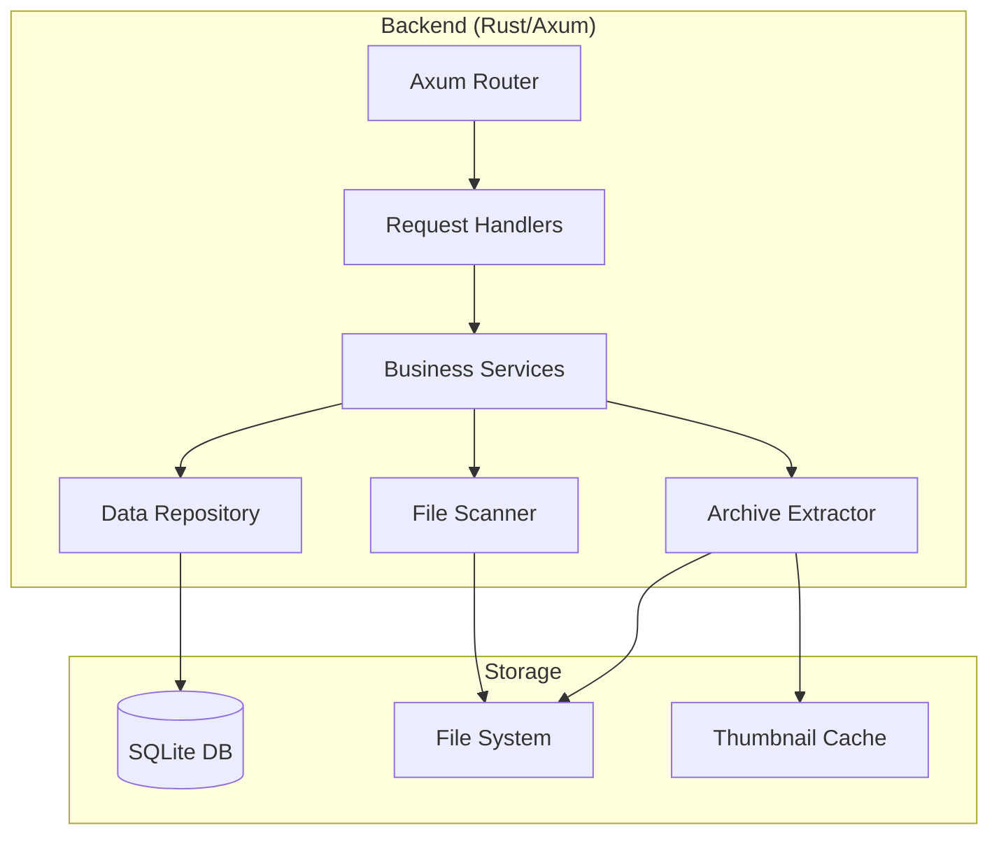
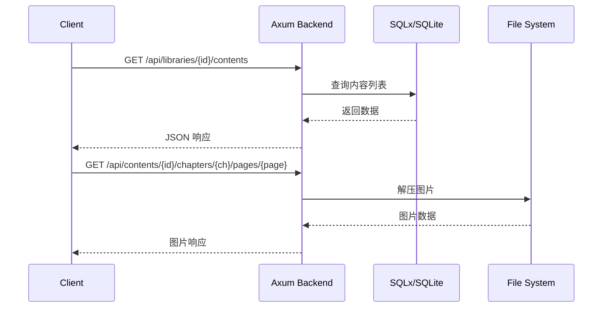

# Design Document

## Overview

本设计文档描述了漫画/小说阅读软件后端的技术架构和实现方案。

- **后端**: Rust + Axum + SQLx
- **数据库**: SQLite

系统支持多库管理，每个库可关联多个扫描路径，支持漫画（图片）和小说（文本）两种内容类型的导入、管理和阅读。

## Architecture



### 请求流程



## Components and Interfaces

### Backend Components

#### 1. API Router (Axum)

```rust
// 路由定义
pub fn create_router(state: AppState) -> Router {
    Router::new()
        // Library routes
        .route("/api/libraries", get(list_libraries).post(create_library))
        .route("/api/libraries/{id}", get(get_library).put(update_library).delete(delete_library))
        .route("/api/libraries/{id}/contents", get(list_contents))
        .route("/api/libraries/{id}/scan", post(scan_library))
        .route("/api/libraries/{id}/search", get(search_contents))
        
        // Content routes - 统一的内容管理接口，同时用于漫画和小说
        .route("/api/contents/{id}", get(get_content).delete(delete_content))
        .route("/api/contents/{id}/metadata", put(update_content_metadata))
        .route("/api/contents/{id}/chapters", get(list_chapters))
        .route("/api/contents/{id}/progress", get(get_content_progress))  // 获取内容整体进度
        .route("/api/chapters/{id}/progress", get(get_chapter_progress).put(update_chapter_progress))  // 章节进度
        // 漫画特有：获取页面图片
        .route("/api/contents/{id}/chapters/{chapter}/pages/{page}", get(get_page))
        // 小说特有：获取章节文本
        .route("/api/contents/{id}/chapters/{chapter}/text", get(get_chapter_text))
        
        // Auth routes
        .route("/api/auth/login", post(login))
        .route("/api/auth/me", get(get_current_user).put(update_current_user))  // PUT 更新用户信息（包括 bangumi_api_key）
        .route("/api/auth/password", put(update_password))
        
        // Bangumi metadata routes
        .route("/api/bangumi/search", get(search_bangumi))
        
        .with_state(state)
}
```

#### 2. Data Models

```rust
// User 模型
#[derive(Debug, Clone, Serialize, Deserialize, sqlx::FromRow)]
pub struct User {
    pub id: i64,
    pub username: String,
    pub password_hash: String,
    pub bangumi_api_key: Option<String>,  // Bangumi API Key，用于元数据刮削
    pub created_at: DateTime<Utc>,
    pub updated_at: DateTime<Utc>,
}

// JWT Claims
#[derive(Debug, Clone, Serialize, Deserialize)]
pub struct JwtClaims {
    pub sub: i64,        // user_id
    pub username: String,
    pub exp: i64,        // 过期时间戳
    pub iat: i64,        // 签发时间戳
}

// Library 模型 - 库不区分类型，内容类型在 Content 上区分
#[derive(Debug, Clone, Serialize, Deserialize, sqlx::FromRow)]
pub struct Library {
    pub id: i64,
    pub name: String,
    pub scan_interval: i32,         // 扫描间隔（分钟），0 表示禁用
    pub watch_mode: bool,           // 是否启用文件监听
    pub created_at: DateTime<Utc>,
    pub updated_at: DateTime<Utc>,
}

// ScanPath 模型
#[derive(Debug, Clone, Serialize, Deserialize, sqlx::FromRow)]
pub struct ScanPath {
    pub id: i64,
    pub library_id: i64,
    pub path: String,
    pub created_at: DateTime<Utc>,
}

// Content 模型 - 统一的内容模型，同时用于漫画和小说
#[derive(Debug, Clone, Serialize, Deserialize, sqlx::FromRow)]
pub struct Content {
    pub id: i64,
    pub library_id: i64,
    pub scan_path_id: i64,
    pub content_type: ContentType,            // 内容类型：漫画或小说
    pub title: String,
    pub folder_path: String,
    pub chapter_count: i32,
    pub thumbnail: Option<Vec<u8>>,           // 压缩后的缩略图二进制数据
    pub metadata: Option<serde_json::Value>,  // 直接存储 Bangumi API 返回的原始 JSON blob
    pub created_at: DateTime<Utc>,
    pub updated_at: DateTime<Utc>,
}

// metadata 字段说明：
// - 后端直接存储 Bangumi API 返回的原始 JSON blob
// - 不进行结构化序列化/反序列化，保持 API 响应的完整性和灵活性
// - 前端根据需要从 JSON 中提取字段进行展示

// Chapter 模型
#[derive(Debug, Clone, Serialize, Deserialize, sqlx::FromRow)]
pub struct Chapter {
    pub id: i64,
    pub content_id: i64,
    pub title: String,
    pub file_path: String,
    pub sort_order: i32,
}

// ReadingProgress 模型 - 按章节追踪进度
#[derive(Debug, Clone, Serialize, Deserialize, sqlx::FromRow)]
pub struct ReadingProgress {
    pub id: i64,
    pub user_id: i64,
    pub chapter_id: i64,  // 直接关联章节，每个章节独立追踪进度
    pub position: i32,    // 页码(漫画) 或 字符位置(小说)
    pub percentage: f32,  // 章节内的阅读百分比
    pub updated_at: DateTime<Utc>,
}

#[derive(Debug, Clone, Serialize, Deserialize, sqlx::Type)]
#[sqlx(type_name = "TEXT")]
pub enum ContentType {
    Comic,
    Novel,
}
```

#### 3. Service Layer

```rust
// LibraryService - 库管理服务
pub trait LibraryService {
    async fn create_library(&self, req: CreateLibraryRequest) -> Result<Library>;
    async fn get_library(&self, id: i64) -> Result<Option<Library>>;
    async fn list_libraries(&self) -> Result<Vec<LibraryWithStats>>;
    async fn update_library(&self, id: i64, req: UpdateLibraryRequest) -> Result<Library>;
    async fn delete_library(&self, id: i64) -> Result<()>;
    async fn add_scan_path(&self, library_id: i64, path: String) -> Result<ScanPath>;
    async fn remove_scan_path(&self, library_id: i64, path_id: i64) -> Result<()>;
}

// WatchService - 文件监听服务
pub trait WatchService {
    async fn start_watching(&self, library_id: i64) -> Result<()>;
    async fn stop_watching(&self, library_id: i64) -> Result<()>;
    async fn is_watching(&self, library_id: i64) -> bool;
}

// SchedulerService - 定时扫描服务
pub trait SchedulerService {
    async fn schedule_scan(&self, library_id: i64, interval_minutes: i32) -> Result<()>;
    async fn cancel_scan(&self, library_id: i64) -> Result<()>;
    async fn get_next_scan_time(&self, library_id: i64) -> Option<DateTime<Utc>>;
}

// ScanService - 扫描服务
// 扫描到新内容时自动调用 BangumiService 进行元数据刮削
pub trait ScanService {
    async fn scan_library(&self, library_id: i64) -> Result<ScanResult>;
    async fn scan_path(&self, scan_path: &ScanPath) -> Result<Vec<Content>>;
}

// ScanResult - 扫描结果
pub struct ScanResult {
    pub added: Vec<Content>,      // 新增的内容（已自动刮削元数据）
    pub removed: Vec<i64>,        // 已删除的内容 ID
    pub failed_scrape: Vec<(Content, String)>,  // 刮削失败的内容及错误信息
}

// ContentService - 统一的内容服务，同时处理漫画和小说
pub trait ContentService {
    async fn get_content(&self, id: i64) -> Result<Option<Content>>;
    async fn list_contents(&self, library_id: i64) -> Result<Vec<Content>>;
    async fn search_contents(&self, library_id: i64, query: &str) -> Result<Vec<Content>>;
    async fn delete_content(&self, id: i64) -> Result<()>;
    async fn list_chapters(&self, content_id: i64) -> Result<Vec<Chapter>>;
    async fn update_metadata(&self, content_id: i64, metadata: serde_json::Value) -> Result<Content>;
    // 漫画特有：获取页面图片
    async fn get_page(&self, content_id: i64, chapter: i32, page: i32) -> Result<Vec<u8>>;
    // 小说特有：获取章节文本
    async fn get_chapter_text(&self, content_id: i64, chapter: i32) -> Result<String>;
}

// BangumiService - Bangumi 元数据服务
// 注意：直接存储 Bangumi API 返回的 JSON 作为 blob，不进行结构化序列化
pub trait BangumiService {
    // 搜索 Bangumi 条目
    async fn search(&self, query: &str) -> Result<Vec<BangumiSearchResult>>;
    // 获取条目详情（返回原始 JSON）
    async fn get_subject(&self, bangumi_id: i64) -> Result<serde_json::Value>;
    // 自动刮削：根据内容标题搜索并获取最匹配的元数据
    // 搜索策略：使用标题搜索，取第一个结果的详情
    async fn auto_scrape(&self, title: &str) -> Result<Option<serde_json::Value>>;
}


// ProgressService - 进度服务（按章节追踪）
pub trait ProgressService {
    // 获取指定章节的阅读进度
    async fn get_chapter_progress(&self, user_id: i64, chapter_id: i64) -> Result<Option<ReadingProgress>>;
    // 获取内容的所有章节进度（用于计算整体进度）
    async fn get_content_progress(&self, user_id: i64, content_id: i64) -> Result<Vec<ReadingProgress>>;
    // 更新章节进度
    async fn update_progress(&self, user_id: i64, chapter_id: i64, position: i32) -> Result<ReadingProgress>;
}

// AuthService - 认证服务 (使用 JWT)
pub trait AuthService {
    async fn register(&self, username: String, password: String) -> Result<User>;
    async fn login(&self, username: String, password: String) -> Result<(User, String)>;  // 返回 JWT token
    fn verify_token(&self, token: &str) -> Result<JwtClaims>;  // 验证 JWT，无需数据库
    async fn update_password(&self, user_id: i64, old_password: String, new_password: String) -> Result<()>;
    async fn update_user(&self, user_id: i64, req: UpdateUserRequest) -> Result<User>;  // 更新用户信息（如 bangumi_api_key）
}

// UpdateUserRequest - 用户信息更新请求
pub struct UpdateUserRequest {
    pub bangumi_api_key: Option<String>,
}
```

#### 4. Archive Extractor

```rust
// 压缩包解压器接口
pub trait ArchiveExtractor {
    fn supported_extensions(&self) -> &[&str];
    fn list_files(&self, archive_path: &Path) -> Result<Vec<String>>;
    fn extract_file(&self, archive_path: &Path, file_name: &str) -> Result<Vec<u8>>;
}

// 漫画压缩包解压器 (ZIP, CBZ, CBR, RAR)
pub struct ComicArchiveExtractor;

// 小说压缩包解压器 (ZIP, EPUB, TXT)
pub struct NovelArchiveExtractor;
```

## Data Models

### Database Schema (SQLite)

```sql
-- 库表 - 不区分类型，内容类型在 contents 表上区分
CREATE TABLE libraries (
    id INTEGER PRIMARY KEY AUTOINCREMENT,
    name TEXT NOT NULL,
    scan_interval INTEGER NOT NULL DEFAULT 0,
    watch_mode INTEGER NOT NULL DEFAULT 0,
    created_at TEXT NOT NULL DEFAULT (datetime('now')),
    updated_at TEXT NOT NULL DEFAULT (datetime('now'))
);

-- 扫描路径表
CREATE TABLE scan_paths (
    id INTEGER PRIMARY KEY AUTOINCREMENT,
    library_id INTEGER NOT NULL REFERENCES libraries(id) ON DELETE CASCADE,
    path TEXT NOT NULL,
    created_at TEXT NOT NULL DEFAULT (datetime('now')),
    UNIQUE(library_id, path)
);

-- 内容表 - 统一存储漫画和小说
CREATE TABLE contents (
    id INTEGER PRIMARY KEY AUTOINCREMENT,
    library_id INTEGER NOT NULL REFERENCES libraries(id) ON DELETE CASCADE,
    scan_path_id INTEGER NOT NULL REFERENCES scan_paths(id) ON DELETE CASCADE,
    content_type TEXT NOT NULL CHECK (content_type IN ('comic', 'novel')),
    title TEXT NOT NULL,
    folder_path TEXT NOT NULL,
    chapter_count INTEGER NOT NULL DEFAULT 0,
    thumbnail BLOB,      -- 压缩后的缩略图二进制数据
    metadata TEXT,       -- JSON 格式的元数据 (Bangumi API 原始响应)
    created_at TEXT NOT NULL DEFAULT (datetime('now')),
    updated_at TEXT NOT NULL DEFAULT (datetime('now')),
    UNIQUE(library_id, folder_path)
);

-- 章节表 - 统一存储漫画和小说的章节
CREATE TABLE chapters (
    id INTEGER PRIMARY KEY AUTOINCREMENT,
    content_id INTEGER NOT NULL REFERENCES contents(id) ON DELETE CASCADE,
    title TEXT NOT NULL,
    file_path TEXT NOT NULL,
    sort_order INTEGER NOT NULL,
    UNIQUE(content_id, file_path)
);

-- 用户表
CREATE TABLE users (
    id INTEGER PRIMARY KEY AUTOINCREMENT,
    username TEXT NOT NULL UNIQUE,
    password_hash TEXT NOT NULL,
    bangumi_api_key TEXT,  -- Bangumi API Key，用于元数据刮削
    created_at TEXT NOT NULL DEFAULT (datetime('now')),
    updated_at TEXT NOT NULL DEFAULT (datetime('now'))
);


-- 阅读进度表 - 按章节追踪阅读进度
CREATE TABLE reading_progress (
    id INTEGER PRIMARY KEY AUTOINCREMENT,
    user_id INTEGER NOT NULL REFERENCES users(id) ON DELETE CASCADE,
    chapter_id INTEGER NOT NULL REFERENCES chapters(id) ON DELETE CASCADE,
    position INTEGER NOT NULL DEFAULT 0,  -- 页码(漫画) 或 字符位置(小说)
    percentage REAL NOT NULL DEFAULT 0.0, -- 章节内的阅读百分比
    updated_at TEXT NOT NULL DEFAULT (datetime('now')),
    UNIQUE(user_id, chapter_id)  -- 每个用户每个章节一条进度记录
);

-- 索引
CREATE INDEX idx_scan_paths_library ON scan_paths(library_id);
CREATE INDEX idx_contents_library ON contents(library_id);
CREATE INDEX idx_contents_scan_path ON contents(scan_path_id);
CREATE INDEX idx_contents_title ON contents(title);
CREATE INDEX idx_chapters_content ON chapters(content_id);
CREATE INDEX idx_users_username ON users(username);
CREATE INDEX idx_reading_progress_user ON reading_progress(user_id);
CREATE INDEX idx_reading_progress_chapter ON reading_progress(chapter_id);

```


## Correctness Properties

*A property is a characteristic or behavior that should hold true across all valid executions of a system-essentially, a formal statement about what the system should do. Properties serve as the bridge between human-readable specifications and machine-verifiable correctness guarantees.*

Based on the prework analysis, the following properties have been identified. Redundant properties have been consolidated.

### Property 1: Library CRUD Round-Trip

*For any* valid library name, content type, scan interval, and watch mode, creating a library and then retrieving it should return a library with the same values.

**Validates: Requirements 1.1, 1.7**

### Property 2: Scan Path Association Integrity

*For any* library and valid scan path, adding the path to the library and then listing the library's paths should include that path.

**Validates: Requirements 1.2**

### Property 3: Cascade Deletion - Scan Path Removal

*For any* library with scan paths and associated contents, removing a scan path should delete all contents that were imported from that path while preserving contents from other paths.

**Validates: Requirements 1.3**

### Property 4: Library Statistics Accuracy

*For any* library with scan paths and contents, the library statistics (path count, content count) should match the actual number of associated records in the database.

**Validates: Requirements 1.4**

### Property 5: Content Retrieval Completeness

*For any* library with contents across multiple scan paths, querying the library's contents should return all contents from all associated scan paths.

**Validates: Requirements 1.5**

### Property 6: Cascade Deletion - Library Removal

*For any* library with scan paths and contents, deleting the library should remove all associated scan paths and contents from the database.

**Validates: Requirements 1.6**

### Property 7: Chapter Sorting Consistency

*For any* set of chapter filenames, sorting them should produce a consistent order where chapters are arranged by their natural sort order (handling numeric prefixes correctly).

**Validates: Requirements 2.2, 2.3**

### Property 8: Content Title Derivation

*For any* imported content, the content title should equal the folder name from which it was imported.

**Validates: Requirements 2.4**

### Property 9: Content-ScanPath Association

*For any* imported content, the content should have a valid scan_path_id that references the scan path from which it was imported.

**Validates: Requirements 2.7**

### Property 10: Content Deletion Cascade

*For any* content with chapters, deleting the content should remove all associated chapter records from the database.

**Validates: Requirements 2.9**

### Property 11: Search Result Relevance

*For any* search query and library, all returned contents should have titles that contain the search keyword (case-insensitive).

**Validates: Requirements 2.10**

### Property 12: Image Ordering Consistency

*For any* comic chapter, the images should be returned in a consistent order based on their filenames within the archive.

**Validates: Requirements 3.2**

### Property 13: Progress Persistence Round-Trip

*For any* content and valid progress data, saving the progress and then retrieving it should return equivalent progress values.

**Validates: Requirements 3.5, 4.5, 5.1**

### Property 14: Progress Percentage Accuracy

*For any* content with reading progress, the percentage should accurately reflect the position relative to the total content (pages for comics, chapters for novels).

**Validates: Requirements 5.4**

### Property 15: API Response Completeness

*For any* content list request, the response should contain all required fields (id, title, chapterCount, thumbnailUrl) for each content item.

**Validates: Requirements 7.1**

### Property 16: Progress Validation

*For any* progress update request, invalid data (negative position, percentage > 100, non-existent content_id) should be rejected with an appropriate error response.

**Validates: Requirements 7.4**

### Property 17: Error Response Structure

*For any* invalid API request, the error response should contain an HTTP error code and a descriptive error message.

**Validates: Requirements 7.5**

### Property 18: JSON Serialization Round-Trip

*For any* valid content data structure, serializing to JSON and then deserializing should produce an equivalent data structure.

**Validates: Requirements 8.2, 8.3, 8.4**

### Property 19: Scan Interval Configuration

*For any* library with a non-zero scan interval, the scheduler should have a scheduled task for that library, and the next scan time should be within the configured interval from the last scan.

**Validates: Requirements 1.8**

### Property 20: Watch Mode State Consistency

*For any* library with watch mode enabled, the watch service should be actively monitoring all associated scan paths.

**Validates: Requirements 1.9, 1.10, 1.11**

### Property 21: Metadata JSON Blob Storage

*For any* valid JSON blob from Bangumi API, storing it directly in the comic record and then retrieving it should return an equivalent JSON structure.

**Validates: Requirements 8.4, 8.6**

### Property 22: User Registration Uniqueness

*For any* username, attempting to register with an already existing username should fail with an appropriate error.

**Validates: Requirements 9.1**

### Property 23: Password Hashing Security

*For any* user password, the stored password_hash should not equal the original password, and verifying the correct password should succeed.

**Validates: Requirements 9.1, 9.2**

### Property 24: JWT Token Validity

*For any* valid login, the returned JWT token should be verifiable and contain the correct user information until expiration.

**Validates: Requirements 9.2, 9.4**

### Property 25: Progress User Isolation

*For any* two different users reading the same content, their reading progress should be stored and retrieved independently.

**Validates: Requirements 9.7**

## Logging

### Backend Logging (tracing)

后端使用 `tracing` 生态系统进行结构化日志记录：

```rust
// 依赖配置
// tracing = "0.1"
// tracing-subscriber = { version = "0.3", features = ["env-filter"] }

// 日志初始化
use tracing_subscriber::{layer::SubscriberExt, util::SubscriberInitExt, EnvFilter};

fn init_tracing() {
    tracing_subscriber::registry()
        .with(EnvFilter::try_from_default_env().unwrap_or_else(|_| "info".into()))
        .with(tracing_subscriber::fmt::layer())
        .init();
}

// 使用示例
use tracing::{info, warn, error, debug, instrument};

#[instrument(skip(pool))]
async fn scan_library(pool: &SqlitePool, library_id: i64) -> Result<ScanResult> {
    info!(library_id, "Starting library scan");
    // ...
    debug!(content_count = contents.len(), "Scan completed");
    Ok(result)
}
```

日志级别通过 `RUST_LOG` 环境变量控制：
- `RUST_LOG=debug` - 详细调试信息
- `RUST_LOG=info` - 常规运行信息（默认）
- `RUST_LOG=warn` - 警告和错误
- `RUST_LOG=backend=debug,sqlx=warn` - 模块级别控制

## Error Handling

### Backend Error Handling

```rust
// 统一错误类型
#[derive(Debug, thiserror::Error)]
pub enum AppError {
    #[error("Not found: {0}")]
    NotFound(String),
    
    #[error("Invalid input: {0}")]
    BadRequest(String),
    
    #[error("Database error: {0}")]
    Database(#[from] sqlx::Error),
    
    #[error("File system error: {0}")]
    FileSystem(#[from] std::io::Error),
    
    #[error("Archive error: {0}")]
    Archive(String),
    
    #[error("Internal error: {0}")]
    Internal(String),
}

// 转换为 HTTP 响应
impl IntoResponse for AppError {
    fn into_response(self) -> Response {
        let (status, message) = match &self {
            AppError::NotFound(msg) => (StatusCode::NOT_FOUND, msg.clone()),
            AppError::BadRequest(msg) => (StatusCode::BAD_REQUEST, msg.clone()),
            AppError::Database(_) => (StatusCode::INTERNAL_SERVER_ERROR, "Database error".to_string()),
            AppError::FileSystem(_) => (StatusCode::INTERNAL_SERVER_ERROR, "File system error".to_string()),
            AppError::Archive(msg) => (StatusCode::UNPROCESSABLE_ENTITY, msg.clone()),
            AppError::Internal(msg) => (StatusCode::INTERNAL_SERVER_ERROR, msg.clone()),
        };
        
        let body = Json(json!({
            "error": {
                "code": status.as_u16(),
                "message": message
            }
        }));
        
        (status, body).into_response()
    }
}
```

## Testing Strategy

### Dual Testing Approach

本项目采用单元测试和属性测试相结合的测试策略：

- **单元测试**: 验证具体示例和边界情况
- **属性测试**: 验证在所有有效输入上都应成立的通用属性

### Property-Based Testing Framework

**后端 (Rust)**: 使用 `proptest` 库进行属性测试

```toml
[dev-dependencies]
proptest = "1.4"
```

### Test Configuration

- 每个属性测试配置运行至少 100 次迭代
- 每个属性测试必须使用注释标注对应的正确性属性：`**Feature: comic-reader, Property {number}: {property_text}**`

### Unit Test Coverage

单元测试覆盖以下场景：

1. **API 端点测试**
   - 正常请求响应
   - 错误请求处理
   - 边界条件

2. **服务层测试**
   - 业务逻辑验证
   - 数据转换

3. **数据访问层测试**
   - CRUD 操作
   - 查询逻辑

### Property Test Coverage

属性测试覆盖设计文档中定义的 18 个正确性属性，每个属性对应一个独立的属性测试。

### Test File Organization

```
backend/
├── src/
│   └── ...
└── tests/
    ├── unit/
    │   ├── library_tests.rs
    │   ├── content_tests.rs
    │   └── progress_tests.rs
    └── property/
        ├── library_props.rs
        ├── content_props.rs
        ├── search_props.rs
        └── serialization_props.rs
```
