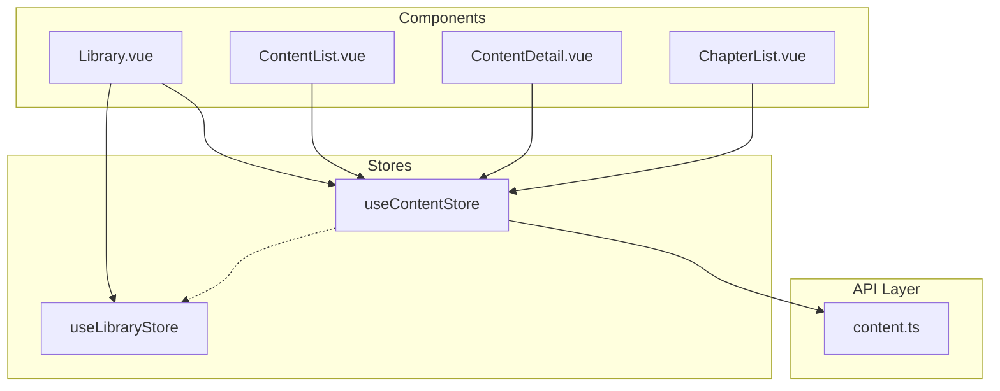
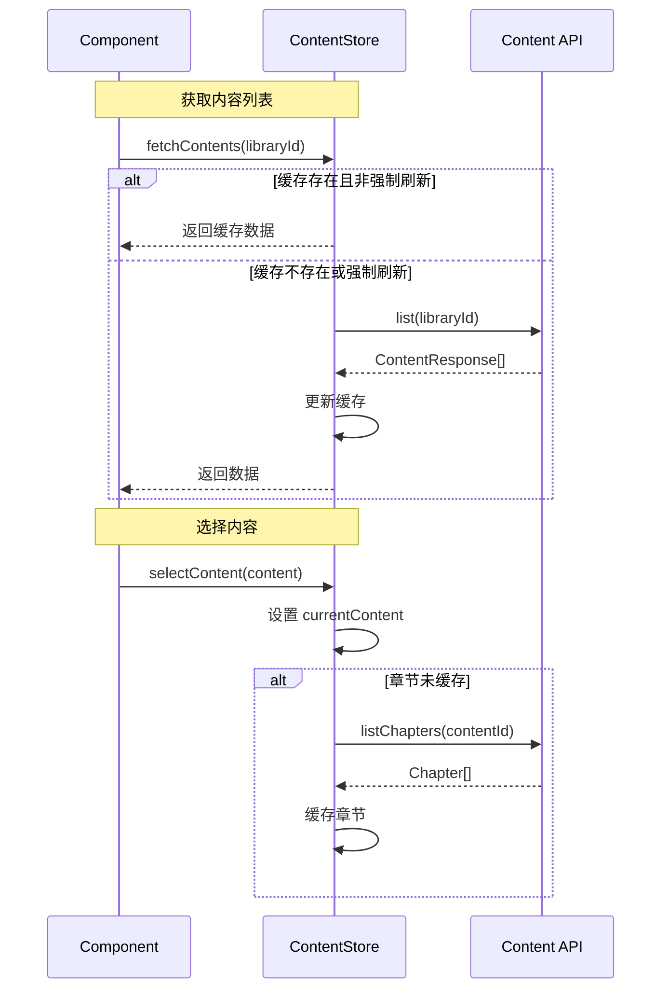

# Design Document: Content Store

## Overview

本设计为 Wyuri 前端项目创建 `useContentStore`，用于管理库内内容（漫画/小说）的状态。主要目标：

1. 按 libraryId 缓存内容列表，避免重复 API 调用
2. 管理当前选中内容及其章节
3. 提供搜索功能
4. 与 `useLibraryStore` 配合，实现完整的内容浏览体验

## Architecture



### Store 职责

| Store | 职责 |
|-------|------|
| useLibraryStore | 库列表、当前库选择 |
| useContentStore | 内容列表缓存、当前内容、章节、搜索 |

## Components and Interfaces

### useContentStore

```typescript
interface ContentState {
  // 按 libraryId 缓存的内容列表
  contents: Map<number, ContentResponse[]>
  // 当前选中的内容
  currentContent: ContentResponse | null
  // 当前内容的章节列表（按 contentId 缓存）
  chapters: Map<number, Chapter[]>
  // 加载状态
  loading: boolean
  // 错误信息
  error: string | null
}

interface ContentStore extends ContentState {
  // Getters
  contentsByLibrary: (libraryId: number) => ContentResponse[]
  currentChapters: Chapter[]
  
  // Actions
  fetchContents(libraryId: number, force?: boolean): Promise<ContentResponse[]>
  searchContents(libraryId: number, query: string): Promise<ContentResponse[]>
  selectContent(content: ContentResponse): Promise<void>
  clearCurrentContent(): void
  deleteContent(id: number): Promise<void>
  invalidateCache(libraryId?: number): void
}
```

## Data Models

### 缓存结构

```typescript
// 内容按 libraryId 分组缓存
contents: Map<number, ContentResponse[]>
// 例如: { 1: [content1, content2], 2: [content3] }

// 章节按 contentId 分组缓存
chapters: Map<number, Chapter[]>
// 例如: { 101: [chapter1, chapter2], 102: [chapter3] }
```

### 数据流



## Correctness Properties

*A property is a characteristic or behavior that should hold true across all valid executions of a system-essentially, a formal statement about what the system should do. Properties serve as the bridge between human-readable specifications and machine-verifiable correctness guarantees.*

### Property 1: Content cache consistency
*For any* library ID and fetched content list, after calling fetchContents, the store's contents map should contain exactly those contents under that library ID key.
**Validates: Requirements 2.1**

### Property 2: Cache hit avoids API call
*For any* library ID that already has cached contents, calling fetchContents without force flag should return cached data without making an API call.
**Validates: Requirements 2.2**

### Property 3: Force refresh updates cache
*For any* library ID with existing cache, calling fetchContents with force=true should call the API and update the cache with new data.
**Validates: Requirements 2.3**

### Property 4: Content selection updates state atomically
*For any* content, calling selectContent should set currentContent to that content and fetch its chapters.
**Validates: Requirements 4.1, 4.2**

### Property 5: Chapter cache hit avoids API call
*For any* content whose chapters are already cached, selecting it again should not make an API call for chapters.
**Validates: Requirements 4.3**

### Property 6: Content deletion removes from cache
*For any* content that is deleted, it should no longer appear in the contents map, and if it was currentContent, both currentContent and its chapters should be cleared.
**Validates: Requirements 5.1, 5.2**

### Property 7: Error cleared on new operation
*For any* store state with an existing error, starting a new API operation should clear the error state before the operation begins.
**Validates: Requirements 6.2**

## Error Handling

| 场景 | 处理方式 |
|------|---------|
| 获取内容列表失败 | 设置 error 状态，保持现有缓存 |
| 获取章节失败 | 设置 error 状态，currentContent 保持设置 |
| 删除内容失败 | 抛出错误，不修改缓存 |
| 搜索失败 | 设置 error 状态，返回空数组 |

## Testing Strategy

### 测试框架

- **单元测试**: Vitest
- **属性测试**: fast-check

### 属性测试要求

- 每个属性测试必须运行至少 100 次迭代
- 每个属性测试必须标注对应的 correctness property
- 格式: `**Feature: content-store, Property {number}: {property_text}**`

### 测试文件结构

```
frontend/
├── src/
│   └── stores/
│       └── useContentStore.ts
└── tests/
    └── stores/
        └── content.props.test.ts
```

### Mock 策略

由于 Content Store 依赖 API 调用，测试时需要 mock `createContentApi`：

```typescript
// 测试中 mock API
const mockContentApi = {
  list: vi.fn(),
  listChapters: vi.fn(),
  delete: vi.fn(),
  search: vi.fn(),
}
```
