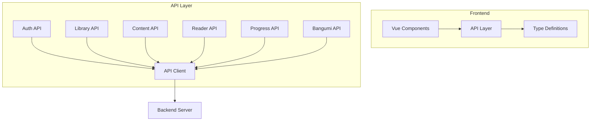

# Frontend API Design Document

## Overview

本设计文档描述前端 API 层的技术实现方案。该 API 层将作为前端与后端之间的通信桥梁，提供类型安全的 TypeScript 接口，封装所有 HTTP 请求逻辑，并提供统一的错误处理机制。

API 层将位于 `frontend/src/api/` 目录下，采用模块化设计，每个功能域（认证、内容库、内容、进度等）独立成模块。

## Architecture



### 目录结构

```
frontend/src/api/
├── index.ts           # 统一导出
├── client.ts          # HTTP 客户端基础设施
├── types.ts           # TypeScript 类型定义
├── auth.ts            # 认证 API
├── library.ts         # 内容库 API
├── content.ts         # 内容 API
├── reader.ts          # 阅读器 API
├── progress.ts        # 进度 API
└── bangumi.ts         # Bangumi API
```

## Components and Interfaces

### API Client (`client.ts`)

核心 HTTP 客户端，封装 fetch API，提供统一的请求/响应处理。

```typescript
interface ApiClientConfig {
  baseUrl: string;
  getToken?: () => string | null;
}

class ApiClient {
  constructor(config: ApiClientConfig);
  
  // HTTP 方法
  get<T>(path: string, options?: RequestOptions): Promise<T>;
  post<T>(path: string, body?: unknown, options?: RequestOptions): Promise<T>;
  put<T>(path: string, body?: unknown, options?: RequestOptions): Promise<T>;
  delete<T>(path: string, options?: RequestOptions): Promise<T>;
}

interface RequestOptions {
  params?: Record<string, string | number>;
  headers?: Record<string, string>;
  requiresAuth?: boolean;
}
```

### ApiError

统一的错误类型，包含状态码和错误消息。

```typescript
class ApiError extends Error {
  constructor(
    public status: number,
    public message: string,
    public details?: unknown
  );
}
```

### Auth API (`auth.ts`)

```typescript
interface AuthApi {
  login(username: string, password: string): Promise<LoginResponse>;
  getMe(): Promise<UserResponse>;
  updateMe(request: UpdateUserRequest): Promise<UserResponse>;
  updatePassword(request: UpdatePasswordRequest): Promise<void>;
}
```

### Library API (`library.ts`)

```typescript
interface LibraryApi {
  list(): Promise<LibraryWithStats[]>;
  create(request: CreateLibraryRequest): Promise<Library>;
  get(id: number): Promise<LibraryWithStats>;
  update(id: number, request: UpdateLibraryRequest): Promise<Library>;
  delete(id: number): Promise<void>;
  listScanPaths(libraryId: number): Promise<ScanPath[]>;
  addScanPath(libraryId: number, path: string): Promise<ScanPath>;
  removeScanPath(libraryId: number, pathId: number): Promise<void>;
}
```

### Content API (`content.ts`)

```typescript
interface ContentApi {
  list(libraryId: number): Promise<ContentResponse[]>;
  search(libraryId: number, query: string): Promise<ContentResponse[]>;
  get(id: number): Promise<ContentResponse>;
  delete(id: number): Promise<void>;
  updateMetadata(id: number, metadata: unknown | null): Promise<ContentResponse>;
  listChapters(contentId: number): Promise<Chapter[]>;
  triggerScan(libraryId: number): Promise<SubmitScanResponse>;
}
```

### Reader API (`reader.ts`)

```typescript
interface ReaderApi {
  getPageUrl(contentId: number, chapter: number, page: number): string;
  getChapterText(contentId: number, chapter: number): Promise<ChapterTextResponse>;
}
```

### Progress API (`progress.ts`)

```typescript
interface ProgressApi {
  getContentProgress(contentId: number): Promise<ContentProgressResponse>;
  getChapterProgress(chapterId: number): Promise<ProgressResponse | null>;
  updateChapterProgress(
    chapterId: number, 
    position: number, 
    percentage?: number
  ): Promise<ProgressResponse>;
}
```

### Bangumi API (`bangumi.ts`)

```typescript
interface BangumiApi {
  search(query: string): Promise<BangumiSearchResult[]>;
}
```

## Data Models

### 认证相关类型

```typescript
interface LoginRequest {
  username: string;
  password: string;
}

interface LoginResponse {
  user: UserResponse;
  token: string;
}

interface UserResponse {
  id: number;
  username: string;
  bangumi_api_key: string | null;
  created_at: string;
}

interface UpdateUserRequest {
  bangumi_api_key?: string | null;
}

interface UpdatePasswordRequest {
  old_password: string;
  new_password: string;
}
```

### 内容库相关类型

```typescript
interface Library {
  id: number;
  name: string;
  scan_interval: number;
  watch_mode: boolean;
  created_at: string;
  updated_at: string;
}

interface LibraryWithStats extends Library {
  path_count: number;
  content_count: number;
}

interface CreateLibraryRequest {
  name: string;
  scan_interval?: number;
  watch_mode?: boolean;
}

interface UpdateLibraryRequest {
  name?: string;
  scan_interval?: number;
  watch_mode?: boolean;
}

interface ScanPath {
  id: number;
  library_id: number;
  path: string;
  created_at: string;
}
```

### 内容相关类型

```typescript
enum ContentType {
  Comic = "Comic",
  Novel = "Novel"
}

interface ContentResponse {
  id: number;
  library_id: number;
  content_type: ContentType;
  title: string;
  chapter_count: number;
  has_thumbnail: boolean;
  metadata: unknown | null;
  created_at: string;
}

interface Chapter {
  id: number;
  content_id: number;
  title: string;
  file_path: string;
  sort_order: number;
}

interface ChapterTextResponse {
  text: string;
}

interface UpdateMetadataRequest {
  metadata: unknown | null;
}
```

### 进度相关类型

```typescript
interface ProgressResponse {
  chapter_id: number;
  position: number;
  percentage: number;
  updated_at: string;
}

interface ContentProgressResponse {
  content_id: number;
  total_chapters: number;
  completed_chapters: number;
  current_chapter_id: number | null;
  overall_percentage: number;
}

interface UpdateProgressRequest {
  position: number;
  percentage?: number;
}
```

### 扫描任务相关类型

```typescript
interface ScanTask {
  id: string;
  library_id: number;
  status: string;
  progress: number;
  message: string | null;
  created_at: string;
  updated_at: string;
}

interface SubmitScanResponse {
  task_id: string;
}
```

### Bangumi 相关类型

```typescript
interface BangumiSearchResult {
  id: number;
  name: string;
  name_cn: string | null;
  summary: string | null;
  image: string | null;
}
```


## Correctness Properties

*A property is a characteristic or behavior that should hold true across all valid executions of a system-essentially, a formal statement about what the system should do. Properties serve as the bridge between human-readable specifications and machine-verifiable correctness guarantees.*

Based on the prework analysis, the following properties have been identified. After reflection, several properties related to serialization can be combined into comprehensive round-trip properties.

### Property Reflection

The following redundancies were identified and consolidated:
- Requirements 1.4, 1.5, 1.6, 8.4, 8.5 all relate to JSON serialization/deserialization - consolidated into a single round-trip property
- Requirements 8.1 is covered by the round-trip property since type correctness is validated through serialization

### Property 1: Request URL Construction

*For any* API endpoint call with a configured base URL and path, the resulting request URL SHALL be the concatenation of the base URL and the path.

**Validates: Requirements 1.1**

### Property 2: Authentication Header Injection

*For any* request marked as requiring authentication where a token is available, the request SHALL include an Authorization header with the format "Bearer {token}".

**Validates: Requirements 1.2**

### Property 3: Error Response Parsing

*For any* HTTP response with a non-2xx status code, the API client SHALL throw an ApiError containing the status code and a message extracted from the response body.

**Validates: Requirements 1.3**

### Property 4: Type Serialization Round-Trip

*For any* valid TypeScript request/response object, serializing to JSON and deserializing back SHALL produce an equivalent object.

**Validates: Requirements 1.4, 1.5, 1.6, 8.1, 8.4, 8.5**

### Property 5: ContentType Enum Serialization

*For any* ContentType enum value (Comic or Novel), serializing to JSON SHALL produce the string "Comic" or "Novel" respectively, and deserializing SHALL produce the original enum value.

**Validates: Requirements 8.2**

## Error Handling

### Error Types

API 层定义统一的错误类型：

```typescript
class ApiError extends Error {
  constructor(
    public status: number,
    public message: string,
    public details?: unknown
  ) {
    super(message);
    this.name = 'ApiError';
  }
  
  // 便捷方法
  isUnauthorized(): boolean { return this.status === 401; }
  isNotFound(): boolean { return this.status === 404; }
  isBadRequest(): boolean { return this.status === 400; }
  isServerError(): boolean { return this.status >= 500; }
}
```

### Error Handling Strategy

1. **网络错误**: 当 fetch 失败时，抛出 ApiError，status 为 0
2. **HTTP 错误**: 解析响应体获取错误消息，抛出 ApiError
3. **解析错误**: 当 JSON 解析失败时，抛出 ApiError，包含原始响应文本

### 错误响应格式

后端返回的错误格式：
```json
{
  "error": "Error message here"
}
```

## Testing Strategy

### 测试框架

- **单元测试**: Vitest
- **属性测试**: fast-check (用于 TypeScript 的属性测试库)

### 单元测试

单元测试将覆盖：
- API 客户端的请求构建逻辑
- 错误处理逻辑
- 各 API 模块的方法调用

### 属性测试

属性测试将验证：
- 类型序列化/反序列化的正确性
- URL 构建的正确性
- 认证头注入的正确性
- 错误解析的正确性

每个属性测试将运行至少 100 次迭代。

### 测试文件结构

```
frontend/src/api/
├── __tests__/
│   ├── client.test.ts      # API 客户端单元测试
│   ├── client.prop.test.ts # API 客户端属性测试
│   ├── types.test.ts       # 类型定义单元测试
│   ├── types.prop.test.ts  # 类型序列化属性测试
│   ├── auth.test.ts        # 认证 API 测试
│   ├── library.test.ts     # 内容库 API 测试
│   ├── content.test.ts     # 内容 API 测试
│   ├── progress.test.ts    # 进度 API 测试
│   └── bangumi.test.ts     # Bangumi API 测试
```

### 属性测试标注格式

每个属性测试将使用以下格式标注：

```typescript
/**
 * **Feature: frontend-api, Property 1: Request URL Construction**
 * **Validates: Requirements 1.1**
 */
test.prop([fc.string(), fc.string()], (baseUrl, path) => {
  // test implementation
});
```
