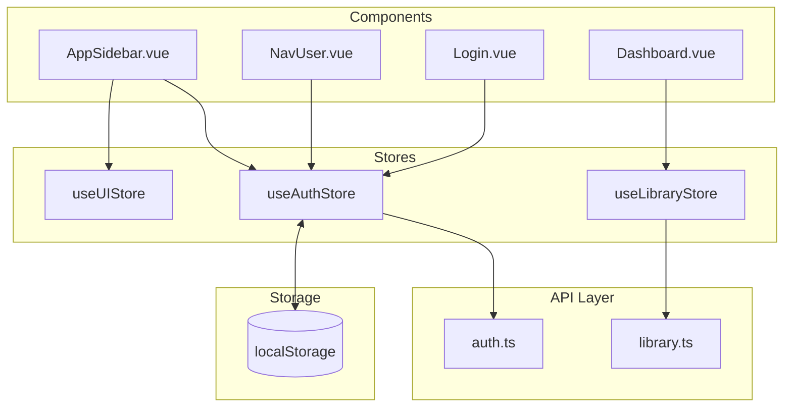
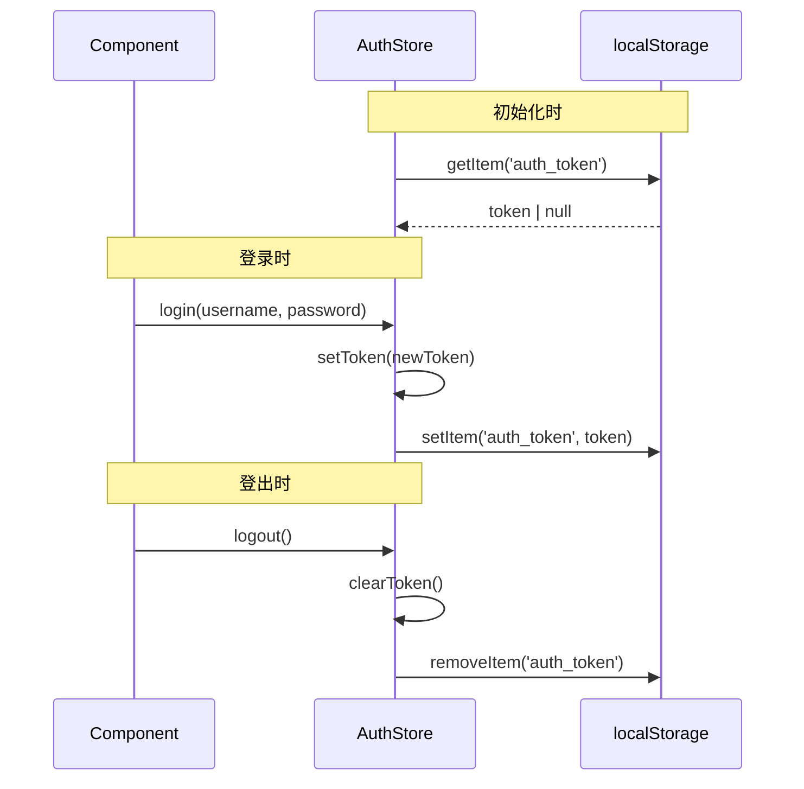

# Design Document: Pinia State Management

## Overview

本设计将 Pinia 状态管理引入 Wyuri 前端项目，替换现有的模块级 ref 状态管理模式。主要目标是：

1. 提供统一的状态管理模式，降低心智负担
2. 支持 Vue DevTools 调试，方便状态追踪
3. 实现状态缓存，减少不必要的 API 调用
4. 修复现有 AppSidebar.vue 中的 bug（`data.user` 未定义）

## Architecture



### Store 职责划分

| Store | 职责 | 持久化 |
|-------|------|--------|
| useAuthStore | 用户认证状态、token 管理、用户信息 | token → localStorage |
| useLibraryStore | 库列表缓存、当前选中库 | 无 |
| useUIStore | 侧边栏状态、全局 UI 偏好 | 可选 |

## Components and Interfaces

### useAuthStore

```typescript
interface AuthState {
  token: string | null
  user: UserResponse | null
  loading: boolean
  error: string | null
}

interface AuthStore extends AuthState {
  // Getters
  isAuthenticated: boolean
  
  // Actions
  login(username: string, password: string): Promise<LoginResponse>
  logout(): void
  fetchUser(): Promise<UserResponse>
  updateUser(request: UpdateUserRequest): Promise<UserResponse>
  updatePassword(request: UpdatePasswordRequest): Promise<void>
}
```

### useLibraryStore

```typescript
interface LibraryState {
  libraries: LibraryWithStats[]
  currentLibrary: LibraryWithStats | null
  loading: boolean
  error: string | null
}

interface LibraryStore extends LibraryState {
  // Getters
  libraryById: (id: number) => LibraryWithStats | undefined
  
  // Actions
  fetchLibraries(): Promise<void>
  selectLibrary(id: number): void
  createLibrary(request: CreateLibraryRequest): Promise<Library>
  updateLibrary(id: number, request: UpdateLibraryRequest): Promise<Library>
  deleteLibrary(id: number): Promise<void>
}
```

### useUIStore

```typescript
interface UIState {
  sidebarCollapsed: boolean
}

interface UIStore extends UIState {
  // Actions
  toggleSidebar(): void
  setSidebarCollapsed(collapsed: boolean): void
}
```

## Data Models

### Token 持久化流程



### 状态初始化

Auth Store 在创建时自动从 localStorage 恢复 token：

```typescript
const token = ref<string | null>(localStorage.getItem(TOKEN_KEY))
```

## Correctness Properties

*A property is a characteristic or behavior that should hold true across all valid executions of a system-essentially, a formal statement about what the system should do. Properties serve as the bridge between human-readable specifications and machine-verifiable correctness guarantees.*

### Property 1: Login updates token and user atomically
*For any* valid login response containing token and user data, after calling the login action, both the store's token and user state should match the response values.
**Validates: Requirements 2.2**

### Property 2: Logout clears all auth state
*For any* auth store state with token and user set, calling logout should result in token being null, user being null, and localStorage not containing the auth token key.
**Validates: Requirements 2.3**

### Property 3: Token persistence round-trip
*For any* token string stored via the auth store, creating a new store instance should restore that same token from localStorage.
**Validates: Requirements 2.4, 2.5**

### Property 4: isAuthenticated reflects token presence
*For any* token state (null or non-null string), the isAuthenticated getter should return true if and only if token is a non-empty string.
**Validates: Requirements 2.6**

### Property 5: Library cache consistency
*For any* array of libraries fetched from the API, the store's libraries state should contain exactly those libraries.
**Validates: Requirements 3.2**

### Property 6: Library selection updates current library
*For any* library ID that exists in the libraries list, calling selectLibrary should set currentLibrary to that library.
**Validates: Requirements 3.3**

### Property 7: Library deletion removes from cache
*For any* library that is deleted, it should no longer appear in the libraries list, and if it was the currentLibrary, currentLibrary should become null.
**Validates: Requirements 3.5**

### Property 8: Sidebar toggle is self-inverse
*For any* initial sidebar collapsed state, calling toggleSidebar twice should return to the original state (toggle is its own inverse).
**Validates: Requirements 4.2**

## Error Handling

### Auth Store 错误处理

| 场景 | 处理方式 |
|------|---------|
| 登录失败 (401) | 抛出错误，不修改 token/user 状态 |
| Token 过期 | API 层拦截 401，调用 logout() 清除状态 |
| 网络错误 | 设置 error 状态，保持现有 token/user |
| fetchUser 失败 | 设置 error 状态，不清除 token（可能是临时网络问题）|

### Library Store 错误处理

| 场景 | 处理方式 |
|------|---------|
| 获取列表失败 | 设置 error 状态，保持现有缓存 |
| 创建/更新失败 | 抛出错误，不修改缓存 |
| 删除失败 | 抛出错误，不修改缓存 |

## Testing Strategy

### 测试框架

- **单元测试**: Vitest（已安装）
- **属性测试**: fast-check（已安装）

### 单元测试覆盖

1. **Auth Store**
   - 初始化时从 localStorage 恢复 token
   - login action 更新状态
   - logout action 清除状态
   - isAuthenticated getter 正确性

2. **Library Store**
   - fetchLibraries 缓存数据
   - selectLibrary 更新 currentLibrary
   - deleteLibrary 更新缓存

3. **UI Store**
   - toggleSidebar 切换状态

### 属性测试要求

- 每个属性测试必须运行至少 100 次迭代
- 每个属性测试必须标注对应的 correctness property
- 格式: `**Feature: pinia-state-management, Property {number}: {property_text}**`

### 测试文件结构

```
frontend/
├── src/
│   └── stores/
│       ├── useAuthStore.ts
│       ├── useLibraryStore.ts
│       └── useUIStore.ts
└── tests/
    └── stores/
        ├── auth.test.ts
        ├── auth.props.test.ts
        ├── library.test.ts
        ├── library.props.test.ts
        └── ui.test.ts
```
