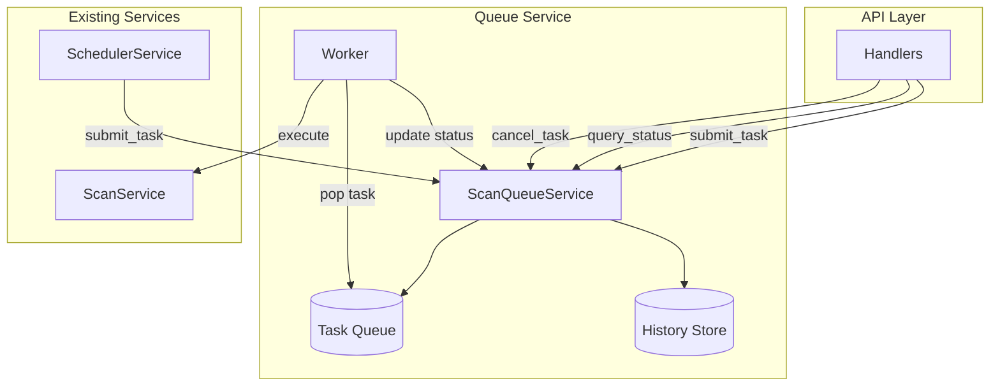

# Design Document: Scan Queue

## Overview

本设计将扫描操作从同步执行改造为基于队列的异步执行模式。核心组件是 `ScanQueueService`，它管理一个内存中的任务队列，使用后台 worker 处理任务，并提供任务状态查询、取消和去重功能。

设计目标：
- 扫描请求立即返回，不阻塞 API
- 支持任务优先级（手动 > 定时）
- 同一库的重复请求自动去重
- 可查询任务状态和历史记录

## Architecture



## Components and Interfaces

### ScanQueueService

主要的队列管理服务，负责任务的创建、调度和状态管理。

```rust
pub struct ScanQueueService {
    /// 待执行任务队列（按优先级和时间排序）
    pending_queue: Arc<RwLock<BinaryHeap<QueuedTask>>>,
    /// 所有任务的状态映射（包括历史）
    tasks: Arc<RwLock<HashMap<Uuid, ScanTask>>>,
    /// 库 ID 到任务 ID 的映射（用于去重）
    library_tasks: Arc<RwLock<HashMap<i64, Uuid>>>,
    /// 扫描服务引用
    scan_service: Arc<ScanService>,
    /// Worker 取消信号
    cancel_tx: Option<tokio::sync::broadcast::Sender<()>>,
}

impl ScanQueueService {
    /// 创建新的队列服务并启动 worker
    pub fn new(scan_service: Arc<ScanService>) -> Self;
    
    /// 提交扫描任务，返回任务 ID
    /// 如果已存在相同库的任务，返回现有任务 ID
    pub async fn submit_task(&self, library_id: i64, priority: TaskPriority) -> Uuid;
    
    /// 查询任务状态
    pub async fn get_task(&self, task_id: Uuid) -> Option<ScanTask>;
    
    /// 查询库的当前任务
    pub async fn get_library_task(&self, library_id: i64) -> Option<ScanTask>;
    
    /// 取消任务
    pub async fn cancel_task(&self, task_id: Uuid) -> Result<()>;
    
    /// 获取所有待执行任务
    pub async fn list_pending(&self) -> Vec<ScanTask>;
    
    /// 获取任务历史（最近 24 小时）
    pub async fn list_history(&self, limit: usize) -> Vec<ScanTask>;
    
    /// 关闭服务
    pub async fn shutdown(&self);
}
```

### Data Models

```rust
/// 任务优先级
#[derive(Debug, Clone, Copy, PartialEq, Eq, PartialOrd, Ord)]
pub enum TaskPriority {
    Normal = 0,  // 定时扫描
    High = 1,    // 手动触发
}

/// 任务状态
#[derive(Debug, Clone, PartialEq, Eq)]
pub enum TaskStatus {
    Pending,    // 等待执行
    Running,    // 正在执行
    Completed,  // 已完成
    Failed,     // 执行失败
    Cancelled,  // 已取消
}

/// 扫描任务
#[derive(Debug, Clone)]
pub struct ScanTask {
    pub id: Uuid,
    pub library_id: i64,
    pub priority: TaskPriority,
    pub status: TaskStatus,
    pub created_at: DateTime<Utc>,
    pub started_at: Option<DateTime<Utc>>,
    pub completed_at: Option<DateTime<Utc>>,
    pub progress: Option<TaskProgress>,
    pub result: Option<TaskResult>,
    pub error: Option<String>,
}

/// 任务进度
#[derive(Debug, Clone)]
pub struct TaskProgress {
    pub scanned_paths: i32,
    pub total_paths: i32,
}

/// 任务结果
#[derive(Debug, Clone)]
pub struct TaskResult {
    pub added_count: i32,
    pub removed_count: i32,
    pub failed_scrape_count: i32,
}

/// 队列中的任务（用于优先级排序）
#[derive(Debug, Clone)]
struct QueuedTask {
    task_id: Uuid,
    priority: TaskPriority,
    created_at: DateTime<Utc>,
}

impl Ord for QueuedTask {
    fn cmp(&self, other: &Self) -> Ordering {
        // 优先级高的排前面，相同优先级按创建时间排序
        other.priority.cmp(&self.priority)
            .then_with(|| self.created_at.cmp(&other.created_at))
    }
}
```

## Data Models

任务数据存储在内存中，使用以下数据结构：

1. **pending_queue**: `BinaryHeap<QueuedTask>` - 优先级队列，按优先级和创建时间排序
2. **tasks**: `HashMap<Uuid, ScanTask>` - 所有任务的完整信息
3. **library_tasks**: `HashMap<i64, Uuid>` - 库 ID 到活跃任务 ID 的映射，用于去重

任务生命周期：
```
Pending -> Running -> Completed/Failed
    |         |
    v         v
Cancelled  Cancelled
```

历史任务清理策略：保留最近 24 小时的已完成/失败/取消任务，超过时间的任务在查询时惰性清理。


## Correctness Properties

*A property is a characteristic or behavior that should hold true across all valid executions of a system-essentially, a formal statement about what the system should do. Properties serve as the bridge between human-readable specifications and machine-verifiable correctness guarantees.*

Based on the acceptance criteria analysis, the following correctness properties must be verified:

### Property 1: Task Creation Adds to Pending Queue

*For any* library_id and priority, when submit_task is called, the returned task_id should correspond to a task in the queue with status Pending (unless deduplicated to an existing task).

**Validates: Requirements 1.1, 1.2**

### Property 2: Queue Ordering by Priority and Time

*For any* set of tasks with different priorities and creation times, when tasks are dequeued, High priority tasks should be processed before Normal priority tasks, and within the same priority, earlier tasks should be processed first.

**Validates: Requirements 1.3, 5.3**

### Property 3: Task Query Returns Correct Status

*For any* task that was submitted, querying by its task_id should return the task with the correct current status.

**Validates: Requirements 2.1**

### Property 4: History Query Returns All Recent Tasks

*For any* set of submitted tasks, querying history should return all tasks that were created within the retention period.

**Validates: Requirements 2.3, 6.3**

### Property 5: Cancel Pending Task Changes Status

*For any* task with Pending status, calling cancel_task should change its status to Cancelled and remove it from the pending queue.

**Validates: Requirements 3.1**

### Property 6: Cancel Completed Task Returns Error

*For any* task with Completed, Failed, or Cancelled status, calling cancel_task should return an error.

**Validates: Requirements 3.3**

### Property 7: Deduplication Returns Existing Task

*For any* library_id that already has a pending or running task, calling submit_task should return the existing task_id instead of creating a new task.

**Validates: Requirements 4.1, 4.2**

### Property 8: Priority Upgrade on Duplicate Submission

*For any* library_id with a pending Normal priority task, submitting a High priority task for the same library should upgrade the existing task's priority to High.

**Validates: Requirements 4.3**

## Error Handling

| Error Condition | Response |
|----------------|----------|
| Cancel non-existent task | Return `NotFound` error |
| Cancel completed/cancelled task | Return `BadRequest` error with message |
| Query non-existent task | Return `None` |
| Worker execution failure | Set task status to `Failed` with error message |

## Testing Strategy

### Property-Based Testing

使用 `proptest` 库进行属性测试，验证上述正确性属性。

测试策略：
1. 生成随机的 library_id 和 priority 组合
2. 模拟多个并发任务提交
3. 验证队列排序、去重和状态转换的正确性

每个属性测试运行至少 100 次迭代。

### Unit Testing

单元测试覆盖：
- 任务创建和状态初始化
- 队列排序逻辑
- 取消操作的边界条件
- 历史记录清理逻辑

### Integration Testing

集成测试验证：
- 与 ScanService 的协作
- Worker 的任务执行流程
- 与 SchedulerService 的集成
