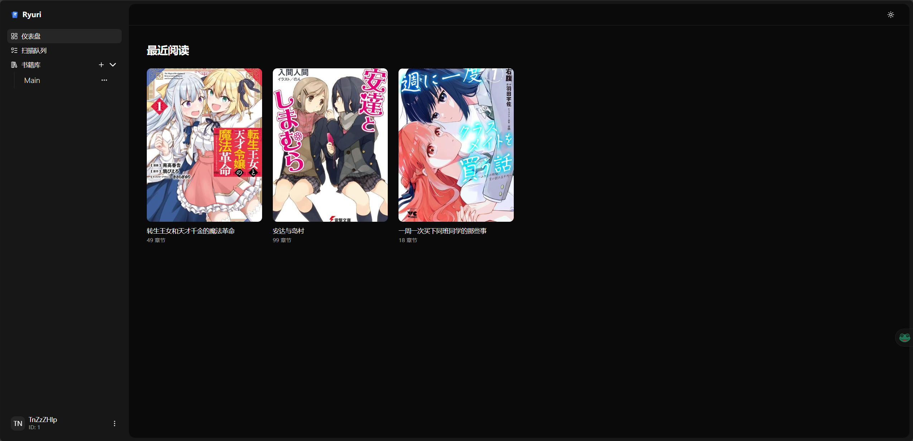
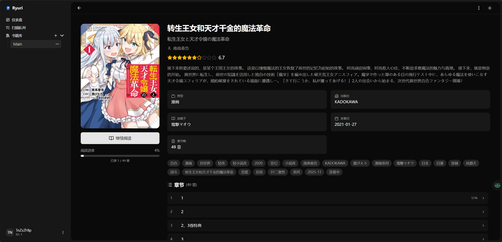
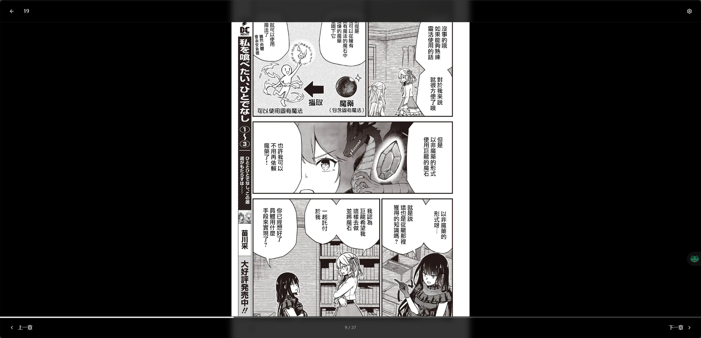

<center>
<h1>
Ryuri
</h1>
</center>

<div style="text-align: center;">
  
</div>

Ryuri 是一个自托管的漫画和电子书阅读服务器，专注于简洁性和兼容性。它允许您管理数字收藏、直接在浏览器中阅读并同步。

<details>

<summary>预览</summary>





</details>

## 功能特性

-   **自托管库**: 整理您的漫画、电子书（支持 zip、rar、cbz、cbr、epub 格式）。
-   **网页阅读器**: 现代化、响应式的网页界面，可在任何设备上阅读。
-   **Komga 兼容性**: 实现了 Komga API，允许您使用如 [Mihon](https://github.com/mihonapp/mihon) 等客户端。
-   **进度追踪**: 自动跨设备追踪您的阅读进度。
-   **内容扫描**: 高效扫描您的文件夹以更新库。

## 技术栈

### 后端

-   **语言**: Rust
-   **框架**: [Axum](https://github.com/tokio-rs/axum)
-   **数据库**: SQLite (通过 [SQLx](https://github.com/launchbadge/sqlx))
-   **核心依赖**: `tokio`, `tower-http`, `zip`, `rar`, `epub`

### 前端

-   **框架**: [Vue.js 3](https://vuejs.org/)
-   **构建工具**: [Vite](https://vitejs.dev/)
-   **语言**: TypeScript
-   **状态管理**: [Pinia](https://pinia.vuejs.org/)
-   **样式**: [Tailwind CSS](https://tailwindcss.com/)
-   **UI 组件**: [shadcn-vue](https://www.shadcn-vue.com/)

## 快速开始

### 前置要求

-   [Rust](https://www.rust-lang.org/tools/install) (最新稳定版)
-   [Node.js](https://nodejs.org/) (推荐 v18+)
-   [pnpm](https://pnpm.io/) (可选，但推荐用于前端)

### 开发环境设置

1.  **克隆仓库:**

    ```bash
    git clone https://github.com/yourusername/Ryuri.git
    cd Ryuri
    ```

2.  **设置后端:**

    ```bash
    cd backend
    # 如有需要创建 .env 文件（如果有 .env.example 请检查）
    cargo run
    ```

    后端服务器通常运行在 `http://localhost:3000`（检查 `main.rs` 或日志以确认）。

3.  **设置前端:**

    ```bash
    cd frontend
    pnpm install
    pnpm dev
    ```

    前端开发服务器将启动，通常代理到后端。

    服务器将启动，通常在 `http://localhost:3000`。

### 从发布版本运行二进制文件

如果您不想从源码构建，可以从 GitHub Releases 页面下载预编译的二进制文件。

1.  **下载二进制文件:**
    前往 [GitHub Releases 页面](https://github.com/TnZzZHlp/Wyuri/releases)，下载适合您操作系统和架构的二进制文件（例如 `ryuri-linux-amd64` 或 `ryuri-windows-amd64.exe`）。

2.  **设置环境变量并运行:**
    导航到下载二进制文件的目录。设置必要的环境变量并运行可执行文件。启动后将立即可以访问网页，默认监听 3000 端口。

    **Linux/macOS:**

    ```bash
    chmod +x ryuri-linux-amd64
    ./ryuri-linux-amd64
    ```

    **Windows (PowerShell):**

    ```powershell
    .\ryuri-windows-amd64.exe
    ```

    **重要的环境变量:**

    -   `DATABASE_URL`: 指定数据库连接字符串，例如 `sqlite:ryuri.db?mode=rwc`。
    -   `JWT_SECRET`: **对安全性至关重要。**请替换为强随机字符串。
    -   `HOST`: （可选）绑定的主机地址（默认: `0.0.0.0`）。
    -   `PORT`: （可选）监听的端口（默认: `3000`）。
    -   `JWT_EXPIRATION_HOURS`: （可选）JWT 令牌的有效期（默认: `24`）。

    服务器将启动，通常在 `http://localhost:3000`。

### 从源码构建和运行

要直接从编译的二进制文件运行 Ryuri，请按照以下步骤操作：

1.  **前置要求:**
    确保您已安装 [Rust](https://www.rust-lang.org/tools/install)（最新稳定版）和 [Node.js](https://nodejs.org/)（推荐 v18+）以及 [pnpm](https://pnpm.io/)。

2.  **克隆仓库:**

    ```bash
    git clone https://github.com/yourusername/Ryuri.git
    cd Ryuri
    ```

3.  **构建后端（发布模式）:**
    首先，构建前端以便其资源可以嵌入到后端二进制文件中。

    ```bash
    cd frontend
    pnpm install
    pnpm build
    cd ..
    ```

    然后，导航到后端目录并以发布模式构建应用程序。

    ```bash
    cd backend
    cargo build --release
    cd ..
    ```

    编译后的二进制文件将位于 `backend/target/release/backend`。

4.  **运行二进制文件:**
    在运行应用程序之前，您需要为数据库和 JWT 密钥设置环境变量。

    **Linux/macOS:**

    ```bash
    export DATABASE_URL="sqlite:ryuri.db?mode=rwc"
    export JWT_SECRET="your_secure_random_string_here"
    ./backend/target/release/backend
    ```

    **Windows (PowerShell):**

    ```powershell
    $env:DATABASE_URL="sqlite:ryuri.db?mode=rwc"
    $env:JWT_SECRET="your_secure_random_string_here"
    .\backend\target\release\backend.exe
    ```

    **重要的环境变量:**

    -   `DATABASE_URL`: 指定数据库连接字符串。对于 SQLite，`sqlite:ryuri.db?mode=rwc` 将在当前目录中创建一个 `ryuri.db` 文件。
    -   `JWT_SECRET`: **对安全性至关重要。**请将 `"your_secure_random_string_here"` 替换为长且随机的唯一字符串。如果没有持久化的密钥，用户会话将在每次重启时失效。
    -   `HOST`: （可选）绑定的主机地址（默认: `0.0.0.0`）。
    -   `PORT`: （可选）监听的端口（默认: `3000`）。
    -   `JWT_EXPIRATION_HOURS`: （可选）JWT 令牌的有效期（默认: `24`）。

    服务器将启动，通常在 `http://localhost:3000`。

### 部署（Docker）

您可以使用官方 Docker 镜像轻松部署 Ryuri。

1.  **拉取镜像:**

    ```bash
    docker pull ghcr.io/tnzzzhlp/wyuri:latest
    ```

    _（注意：如果不同，请将 `tnzzzhlp/wyuri` 替换为您的特定镜像路径）_

2.  **运行容器:**

    ```bash
    docker run -d \
      -p 3000:3000 \
      --name ryuri \
      -v ./ryuri-data:/app/data \
      -v /path/to/your/comics:/comics \
      -e DATABASE_URL="sqlite:/app/data/ryuri.db?mode=rwc" \
      -e JWT_SECRET="change-this-to-a-secure-secret" \
      ghcr.io/tnzzzhlp/wyuri:latest
    ```

    **环境变量:**

    -   `DATABASE_URL`: 数据库的连接字符串。确保它指向卷内的位置（例如 `/app/data`）。
    -   `JWT_SECRET`: 用于签名认证令牌的安全随机字符串。
    -   `JWT_EXPIRATION_HOURS`: （可选）令牌过期时间（小时）（默认: 24）。

    **卷:**

    -   `/app/data`: 数据库的持久存储。
    -   `/comics`: （示例）在此挂载您的本地漫画目录，以将其添加到您的 Ryuri 库中。

## API 文档

Ryuri 为所有前端操作提供 REST API。此外，它在 `/komga` 下公开了 Komga 兼容的 API 层。

-   **标准 API**: 由网页前端用于库管理、阅读和设置。
-   **Komga API**: 有关第三方客户端支持的端点的详细信息，请参见 [KOMGA_API.md](../backend/KOMGA_API.md)。

## 许可证

[MIT](../LICENSE)
